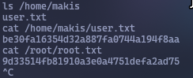

Let's scan the IP address `10.10.10.3`
```bash
sudo nmap -v -sC -sV 10.10.10.3 -oN nmap/initial
```


We see that there is an `FTP server` version `vsFTPd 2.3.4`. There is an exploit for it in `Metasploit`, but it does not work. There is also `Samba 3.0.20-Debian`. Let's try to find an [exploit](https://github.com/MikeRega7/CVE-2007-2447-RCE/tree/main) for it on GitHub.




We've got all flags at once
